# MCA — Multi-Channel Cell Analysis

Self-supervised representation learning for multi-channel multiplexed imaging data (CODEX, IMC, MIBI). The goal is to learn cell embeddings from high-plex protein expression images that (a) separate biologically distinct cell types without any labels, and (b) remain stable across samples and staining batches.

---

## Table of Contents

1. [Project Overview](#project-overview)
2. [Repository Structure](#repository-structure)
3. [Datasets](#datasets)
4. [Model Architectures](#model-architectures)
5. [Training Setup](#training-setup)
6. [Evaluation Metrics](#evaluation-metrics)
7. [Results](#results)
   - [CODEX_cHL](#codex_chl)
   - [CODEX_DLBCL](#codex_dlbcl)
   - [IMC_NB (coarse cell types)](#imc_nb)
   - [IMC_NB_FineCT (fine cell types)](#imc_nb_finect)
   - [MIBI_TNBC](#mibi_tnbc)
   - [MIBI_TNBC Cross-Validation](#mibi_tnbc-cross-validation)
8. [Key Findings](#key-findings)
9. [Region Analysis](#region-analysis)
10. [How to Run](#how-to-run)

---

## Project Overview

Each cell in a multiplexed image is represented as a small spatial patch with C channels (one per antibody marker). The challenge: different cells of the same type may have wildly different absolute intensity levels across tissue samples (batch effects, staining variability), while cells of different types express different relative marker profiles.

The core architectural question is: **how should the C channels be processed?**

- **Early fusion** (ResNet, EarlyFusion): standard convolutions mix channels immediately — learns cross-channel correlations but discards marker-level identity.
- **Channel-independent (CIM)**: depthwise grouped convolutions keep each marker's features strictly separate — marker identity is implicitly encoded, spatial features per marker are preserved.
- **Progressive fusion (CIM_ProgFusion)**: best of both worlds — CIM branch builds per-marker features, a fusion stream gradually integrates them across stages.
- **Attention gating (CIMATT_Gate)**: adds cross-marker self-attention with learned gating based on relative expression, aimed at sample-invariant routing.

All models are trained with **VICReg** (Variance-Invariance-Covariance Regularization), a self-supervised objective that prevents embedding collapse without requiring negative pairs.

---

## Repository Structure

```
MCA/
├── src/                        # Core Python source
│   ├── models.py               # WideModel (CIM), WideModelProgressiveFusion, WideModelAttentionGated
│   ├── models_early_fusion.py  # EarlyFusionModel
│   ├── models_attention.py     # WideModelAttention (without gating)
│   ├── dataset.py              # MCIDataset — HDF5-based cell patch loader
│   ├── transforms.py           # Augmentation transforms
│   ├── VICReg.py               # MVVICReg training objective
│   ├── val_hook.py             # Simple linear-probe evaluation hook
│   └── val_hook_rich.py        # EvaluateModelRich — full evaluation suite
├── configs/
│   ├── _base_/                 # default.py, train_cfg.py, val_cfg.py
│   ├── _augmentations_/        # high.py, low.py, none.py
│   ├── _backbones_/            # CIM.py, CIM_Norm.py, CIM_ProgFusion.py, EarlyFusion_32.py, ResNet.py, CIMATT_Gate.py
│   ├── _algorithms_/           # VICReg.py
│   ├── _datasets_/             # CODEX_cHL.py, CODEX_DLBCL.py, IMC_NB.py, IMC_NB_FineCT.py, MIBI_TNBC.py, MIBI_TNBC_CV{0-4}.py
│   └── _experiments_/          # Per-dataset experiment configs
│       ├── CODEX_cHL/
│       ├── CODEX_DLBCL/
│       ├── IMC_NB/
│       ├── IMC_NB_FineCT/
│       └── MIBI_TNBC/
├── notebooks/                  # Analysis notebooks
├── scripts/                    # Data processing scripts
├── run_experiments.sh          # Run all backbones for one dataset
├── run_cv.sh                   # Run all CV splits
├── run_ablations.sh            # Ablation runs
├── PROGRESS.md                 # Detailed session-by-session progress log
├── MIBI_TNBC_results.xlsx      # Full results table (Excel, generated Feb 2026)
└── z_RUNS/                     # All experiment outputs (metrics, UMAPs, checkpoints)
```

Run outputs are stored at `z_RUNS/<DATASET>_<MODEL>_<ALGORITHM>/` and contain:
- `metrics.json` — all evaluation metrics (linear probe, kNN, clustering, silhouette, neighbourhood purity)
- `umap.png` — UMAP coloured by cell type
- `umap_sample.png` — UMAP coloured by patient/sample ID (to diagnose batch effects)
- `confusion_matrix.png` / `.json` — per-class confusion

---

## Datasets

All datasets are stored as HDF5 files. Each cell is a `C × patch_size × patch_size` tensor centred on the segmented cell.

| Dataset | Technology | Markers | Cell types | Approx. cells | Patch size | Notes |
|---------|-----------|---------|-----------|--------------|-----------|-------|
| **CODEX_cHL** | CODEX | 41 | 17 | ~115k | 32×32 | Classical Hodgkin Lymphoma; excludes FoxP3 and CD56 (poor CODEX SNR) |
| **CODEX_DLBCL** | CODEX | 40 | 18 | ~416k | 24×24 | Diffuse Large B-Cell Lymphoma; largest dataset |
| **IMC_NB** | IMC | 31 | 7 (coarse) | ~240k | 24×24 | Neuroblastoma; coarse 7-class annotation |
| **IMC_NB_FineCT** | IMC | 31 | 11 (fine) | ~237k | 24×24 | Same IMC_NB data with refined 11-class annotation; excludes "Other" |
| **MIBI_TNBC** | MIBI-TOF | 37 | 16 | ~196k | 32×32 | Triple-Negative Breast Cancer; 5 sample-level CV splits |

**CODEX_cHL cell types:** B, CD4, CD8, Cytotoxic CD8, DC, Endothelial, Epithelial, Lymphatic, M1, M2, Mast, Monocyte, NK, Neutrophil, Other, TReg, Tumor

**CODEX_DLBCL cell types:** B, CD4T, CD4TNaive, DC, FDC, Granulo, MC, Macro, NK, NKT, PC, Stromal cells, TFH, TPR, TTOX, TTOXNaive, TTOX_exh, Treg

**IMC_NB cell types:** B_Cell, Myeloid, Other, Progenitor, Stromal, T_Cell, Tumor

**IMC_NB_FineCT cell types:** B_Cell, CD4_T, CD8_T, Myeloid, NK_DC, Neutrophil, Progenitor, Proliferating, Stromal, T_Cell, Tumor

**MIBI_TNBC cell types:** B, CD3 T, CD4 T, CD8 T, DC, DC/Mono, Endothelial, Keratin-positive tumor, Macrophages, Mesenchymal-like, Mono/Neu, NK, Neutrophils, Other immune, Tregs, Tumor

---

## Model Architectures

### CIM — Channel-Independent Model
**Class:** `WideModel` · **Config:** `configs/_backbones_/CIM.py`

The core architecture. A grouped depthwise convolutional network where each marker's spatial patch is processed by its own independent feature extractor (stem + ConvBlocks). Channels are **never mixed** during the backbone computation.

- **Stem:** `Conv2d(C, C×D, kernel_size=3, groups=C)` — expands each marker from 1 to `D=32` features independently
- **Stages:** Two stages of ConvBlocks (grouped, `groups=C`), each followed by `AvgPool2d(2)`
- **Output:** `C×D`-dim vector (`n_markers × 32`) via `AdaptiveAvgPool2d(1)`
- **Feature dim:** depends on dataset (e.g. 37×32 = 1184 for MIBI_TNBC, 41×32 = 1312 for CODEX_cHL)
- **Parameters:** ~1.1M (CODEX_cHL); scales with `C`

**Why it works:** Marker identity is implicitly encoded by the channel position — each channel's weights specialise for that marker's spatial patterns. The resulting embedding is a concatenation of per-marker feature vectors. Cross-marker information is captured only in the projection head (VICReg neck) and the linear probe.

### CIM_Norm — Channel-Independent Model with Input Normalisation
**Class:** `WideModel` with `input_norm=True` · **Config:** `configs/_backbones_/CIM_Norm.py`

Identical to CIM but adds L2-normalisation of the input along the channel dimension before the stem:
```
x = F.normalize(x, dim=1)  # [B, C, H, W] → unit L2 norm per cell
```

This converts absolute intensity vectors into relative expression profiles, removing inter-sample intensity shifts at the input. Consistently improves embedding geometry (silhouette, NMI, ARI) compared to plain CIM with a small reduction in linear probe accuracy.

### CIM_ProgFusion — Progressive Cross-Channel Fusion
**Class:** `WideModelProgressiveFusion` · **Config:** `configs/_backbones_/CIM_ProgFusion.py`

Two parallel branches:

1. **CIM branch** — same depthwise grouped convolutions as CIM; produces per-marker feature maps at each stage.
2. **Fusion stream** — standard (ungrouped) 1×1 convolutions freely mix marker information; receives an *injection* from the CIM branch after the stem and after each stage.

```
Stage k:  CIM_features ──injector──> fusion_stream ──fusion_block──> mixed_features
```

The injectors project CIM features into the fusion stream; fusion blocks are bottleneck mixers (BN → 1×1 → ReLU → 1×1) with residual connections. After the last stage, only the fusion stream output is retained. The result is a fully mixed embedding that was built by gradually integrating single-marker features — a principled middle ground between CIM and EarlyFusion.

Also uses `input_norm=True` (L2-normalised input). Best geometry metrics across all datasets.

### EarlyFusion32 — Standard Early Fusion
**Class:** `EarlyFusionModel` · **Config:** `configs/_backbones_/EarlyFusion_32.py`

Standard convolutional network where all C channels are mixed from the first layer. The stem is a standard (non-grouped) `Conv2d(C, C×32)` that freely combines marker information. This is the most natural baseline — what happens if you treat the multiplexed image like an RGB image with many channels?

**Problem:** At training time, the model learns cross-channel correlations relative to the absolute intensity of each batch. Without per-cell normalisation, it becomes sensitive to per-sample intensity offsets. The UMAPs show strong inter-sample fragmentation (silhouette typically −0.2 or below), meaning cells from different patients cluster by sample rather than by cell type.

### ResNet Baseline
**Class:** `ResNetBaseline` · **Config:** `configs/_backbones_/ResNet.py`

Standard ResNet architecture (base_width=64) applied directly to the multichannel cell patch. Unlike EarlyFusion which has a wide stem, ResNet uses standard residual blocks with cross-channel mixing at every layer. The feature dimension is typically ~256.

**Interesting:** ResNet achieves better inter-sample integration than EarlyFusion (less fragmented UMAPs, higher silhouette) despite also being an early-fusion architecture. The reason is that ResNet's cross-channel mixing from layer 1 implicitly encodes **relative features** (ratios, co-expression patterns) rather than absolute intensities. This makes it somewhat sample-invariant "for free" — but at the cost of lower linear probe accuracy because it cannot easily distinguish cell types that differ only in a single marker's absolute level.

### CIMATT_Gate — CIM with Marker Gating and Cross-Marker Attention
**Class:** `WideModelAttentionGated` · **Config:** `configs/_backbones_/CIMATT_Gate.py`

CIM backbone extended with a learned marker selection mechanism before cross-marker self-attention:

1. **CIM stem + stages:** same depthwise processing as CIM
2. **Spatial pooling:** `x.view(B, C, D, H, W).mean(dim=(-2,-1))` → per-marker token `[B, C, D]`
3. **Marker gating:**
   ```python
   rel   = tokens - tokens.mean(dim=1, keepdim=True)          # relative expression [B, C, D]
   gates = sigmoid(gate_proj(rel).squeeze(-1) / T)            # gate per marker [B, C]
   tokens = tokens * gates.unsqueeze(-1)                      # gated tokens [B, C, D]
   ```
   Gates are computed from **relative** expression (token minus mean token), making them sample-invariant. Temperature `T` is a learned scalar initialised to 5.0 (high init → near-uniform start, allows gradual sharpening).
4. **Cross-marker self-attention:** `MultiheadAttention(embed_dim=D, n_heads=4)` with pre-norm and residual
5. **FFN:** pre-norm feed-forward network per marker token
6. **Additive correction:** attention output is broadcast back and added to the spatial feature map before global avg pool

**Intent:** Route attention toward markers that are distinctively expressed for each cell type, ignoring irrelevant or noisy markers. **Finding:** The gating does improve linear probe accuracy (+0.1pp over plain CIM) but the silhouette remains negative (−0.088), indicating the gates still produce fragmented embeddings — cells of the same type with different relative expression profiles land in different embedding islands. CIM_Norm and CIM_ProgFusion achieve better geometry without attention.

---

## Training Setup

All experiments use the same training pipeline:

| Parameter | Value |
|-----------|-------|
| Algorithm | VICReg (`sim_coeff=25, std_coeff=25, cov_coeff=1`) |
| Iterations | 1,000 (200 linear warmup + 800 cosine decay) |
| Optimiser | AdamW (`lr=3e-4, weight_decay=0.05`) |
| Batch size | 256 |
| Projection head | 2-layer MLP (→ 512 → 512) |
| Augmentations | Strong + weak view pair per cell |
| Workers | 16 |

**CIMATT_Gate_LowAug** variant uses a weaker augmentation schedule (fewer channel perturbations) to prevent the gates from learning augmentation-invariance rather than cell-type-discriminative features.

---

## Evaluation Metrics

All metrics are computed on frozen features (no fine-tuning) at each validation step via `EvaluateModelRich` (`src/val_hook_rich.py`):

| Metric | Description |
|--------|-------------|
| **LP Bal. Acc** | Linear probe balanced accuracy — logistic regression (`class_weight='balanced'`) on frozen embeddings. Primary metric for cell type separability. |
| **LP Top-1 Acc** | Unweighted top-1 accuracy (biased toward majority classes). |
| **kNN Bal. Acc** | k=15 nearest-neighbour classification (distance-weighted cosine) balanced accuracy. Measures metric-space quality without assuming a linear boundary. |
| **NMI** | Normalised Mutual Information between k-means clusters (k = n_classes) and ground truth. |
| **ARI** | Adjusted Rand Index between k-means and ground truth. |
| **Silhouette** | Mean silhouette score (cosine distance, 10k sampled cells). Positive = compact separated clusters, negative = overlapping. |
| **Neigh. Purity** | For each cell, fraction of 15 nearest neighbours with same label. Reported as mean across classes. |

**Note on LP vs kNN:** Linear probe consistently outperforms kNN (e.g. 72.5% vs 52.5% on CODEX_cHL). This is expected — the embedding space has non-trivial geometry and linear decision boundaries extract more information than raw cosine distance. Linear probe is the primary evaluation metric.

---

## Results

> All numbers come directly from `metrics.json` files in the respective `z_RUNS/` directories. Verified against raw files.

---

### CODEX_cHL

17 cell types, 41 markers, ~115k cells. Results at `z_RUNS/CODEX_cHL_<MODEL>_VICReg/`.

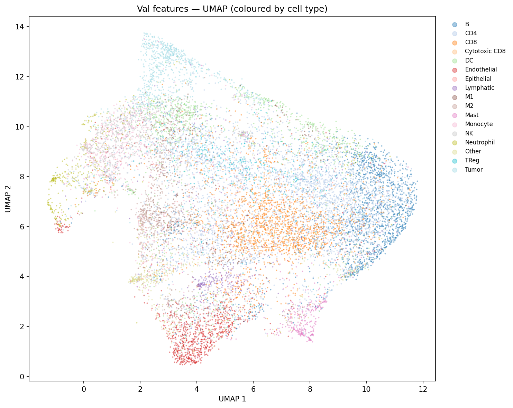
*UMAP of CIM embeddings, CODEX_cHL (coloured by cell type)*

| Model | LP Bal. Acc | kNN Bal. Acc | NMI | ARI | Silhouette | Neigh. Purity |
|-------|------------|-------------|-----|-----|-----------|--------------|
| **CIM** | **0.7248** | **0.5245** | **0.307** | **0.168** | **−0.003** | **0.502** |
| CIM_Norm (AllMarkers) | 0.7220 | 0.5008 | 0.304 | 0.167 | −0.014 | 0.494 |
| CIM (AllMarkers) | 0.7423 | 0.5245 | 0.316 | 0.170 | −0.002 | 0.508 |
| EarlyFusion32 | 0.7073 | 0.4984 | 0.268 | 0.123 | −0.067 | 0.481 |
| ResNet | 0.6183 | 0.4911 | 0.276 | 0.134 | −0.068 | 0.485 |

> **AllMarkers** variants use a slightly expanded marker panel and are run separately. Results for CIM/CIM_Norm/EarlyFusion/ResNet with the standard 41-marker panel are in `CODEX_cHL_<MODEL>_VICReg/`.

**Key observations:**
- CIM achieves the best silhouette (−0.003, near zero) — nearly non-overlapping clusters in cosine space — while all EarlyFusion/ResNet runs sit at −0.07 or worse.
- ResNet is −10.7pp below CIM on linear probe despite similar parameter count (~1.1M each). The early channel mixing destroys marker-level discriminability.
- The performance ceiling at ~72.5% balanced accuracy is real and panel-limited: FoxP3 (defines Tregs) and CD56 (defines NK cells) are absent from the panel, making CD4/TReg and Monocyte/NK pairs irreducibly confusable. This matches KRONOS (ViT-Large, 47M patches) at 73.6% on the same task.

---

### CODEX_DLBCL

18 cell types, 40 markers, ~416k cells. Results at `z_RUNS/CODEX_DLBCL_<MODEL>_VICReg/`.

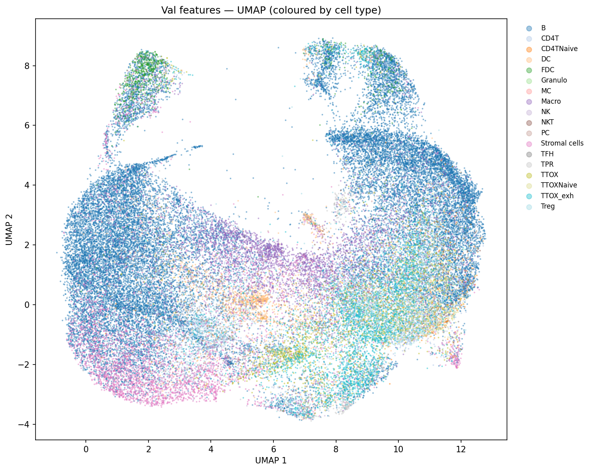
*UMAP of CIM embeddings, CODEX_DLBCL*

| Model | LP Bal. Acc | kNN Bal. Acc | NMI | ARI | Silhouette | Neigh. Purity |
|-------|------------|-------------|-----|-----|-----------|--------------|
| **CIM** | **0.7005** | 0.3613 | 0.195 | 0.102 | −0.050 | 0.592 |
| CIM_Norm | 0.6954 | 0.3910 | **0.247** | 0.098 | **−0.013** | **0.624** |
| CIM_ProgFusion | 0.6883 | **0.4035** | 0.253 | **0.107** | −0.065 | 0.619 |
| EarlyFusion32 | 0.7003 | 0.3901 | 0.189 | 0.055 | −0.192 | 0.627 |
| ResNet | 0.5033 | 0.3366 | 0.222 | 0.071 | −0.094 | 0.615 |

**Key observations:**
- DLBCL has 18 fine-grained B-cell and T-cell subtypes (including CD4TNaive, TTOXNaive, TTOX_exh, TFH). The fine-grained distinctions push LP accuracy down to ~70%.
- CIM_Norm has the best silhouette (−0.013) and purity (0.624), confirming that input normalisation helps on a dataset with strong batch effects across many patient samples.
- ResNet is −19.7pp below CIM, the largest gap across all datasets — DLBCL's fine-grained B/T cell subtypes are maximally dependent on single-marker discrimination.
- EarlyFusion32 achieves nearly the same linear probe accuracy as CIM (0.7003 vs 0.7005) but has dramatically worse geometry (silhouette −0.192 vs −0.050).

---

### IMC_NB

7 coarse cell types, 31 markers, ~240k cells. Results at `z_RUNS/IMC_NB_<MODEL>_VICReg/`.

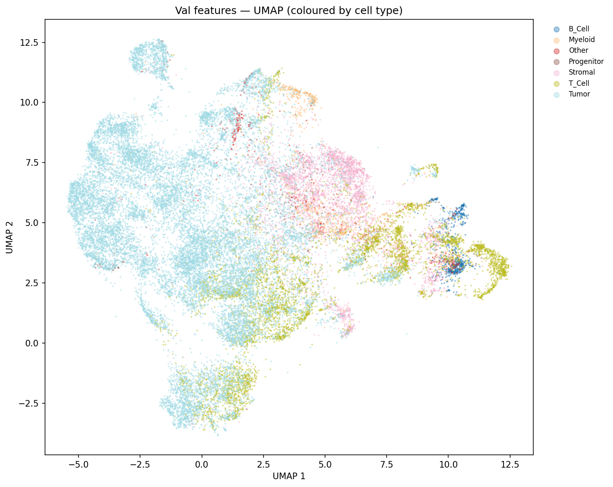
*UMAP of CIM embeddings, IMC_NB*

| Model | LP Bal. Acc | kNN Bal. Acc | NMI | ARI | Silhouette | Neigh. Purity |
|-------|------------|-------------|-----|-----|-----------|--------------|
| CIM | 0.8042 | 0.6422 | 0.270 | 0.193 | +0.058 | 0.787 |
| **EarlyFusion32** | **0.8310** | 0.6777 | 0.276 | 0.188 | **+0.062** | 0.822 |
| ResNet | 0.8021 | **0.6948** | **0.313** | 0.173 | +0.050 | **0.833** |

**Key observations:**
- IMC has only 7 coarse classes (Tumor, T_Cell, B_Cell, Myeloid, Progenitor, Stromal, Other). All silhouette scores are **positive**, indicating well-separated clusters — this is the only dataset where all models achieve positive silhouette.
- EarlyFusion32 leads on LP accuracy (0.831), and ResNet has the best kNN (0.695) and purity (0.833). At 7 coarse classes, cross-channel mixing is less harmful.
- The coarser annotation masks intra-class variation that challenges finer-grained datasets.

---

### IMC_NB_FineCT

11 fine cell types, same 31 markers, ~237k cells. Results at `z_RUNS/IMC_NB_FineCT_<MODEL>_VICReg/`.

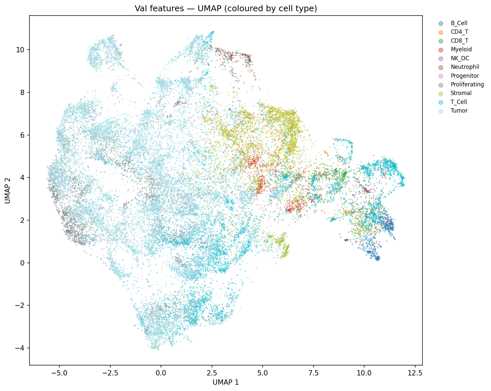
*UMAP of CIM embeddings, IMC_NB_FineCT*

| Model | LP Bal. Acc | kNN Bal. Acc | NMI | ARI | Silhouette | Neigh. Purity |
|-------|------------|-------------|-----|-----|-----------|--------------|
| CIM | 0.8043 | 0.6086 | 0.263 | 0.176 | −0.008 | 0.708 |
| CIM_Norm | 0.8222 | 0.5911 | 0.289 | 0.142 | +0.011 | 0.738 |
| CIM_ProgFusion | 0.8143 | 0.6115 | 0.288 | 0.143 | **+0.030** | 0.742 |
| **EarlyFusion32** | **0.8209** | **0.6548** | 0.281 | **0.151** | +0.035 | **0.755** |
| ResNet | 0.7739 | 0.6256 | **0.332** | 0.170 | +0.050 | 0.779 |

**Key observations:**
- Moving from 7 to 11 classes (splitting T_Cell into CD4_T, CD8_T; Myeloid into finer subtypes) reveals that single-marker differences are important. LP accuracy drops across all models.
- CIM_ProgFusion (silhouette +0.030) and EarlyFusion32 (silhouette +0.035) now outperform plain CIM (−0.008) on geometry. Progressive fusion's cross-marker mixing proves beneficial when finer immune subtypes require co-expression patterns.
- ResNet achieves the best NMI (0.332) and purity (0.779) but the worst LP (0.774) — consistent with its pattern of good cluster structure but poor linear separability.
- EarlyFusion32 is competitive at +11 classes; the gap to CIM narrows compared to CODEX datasets with 17–18 classes.

---

### MIBI_TNBC

16 cell types, 37 markers, ~196k cells. The most heavily studied dataset with multiple variants. Results at `z_RUNS/MIBI_TNBC_<MODEL>_VICReg/`.

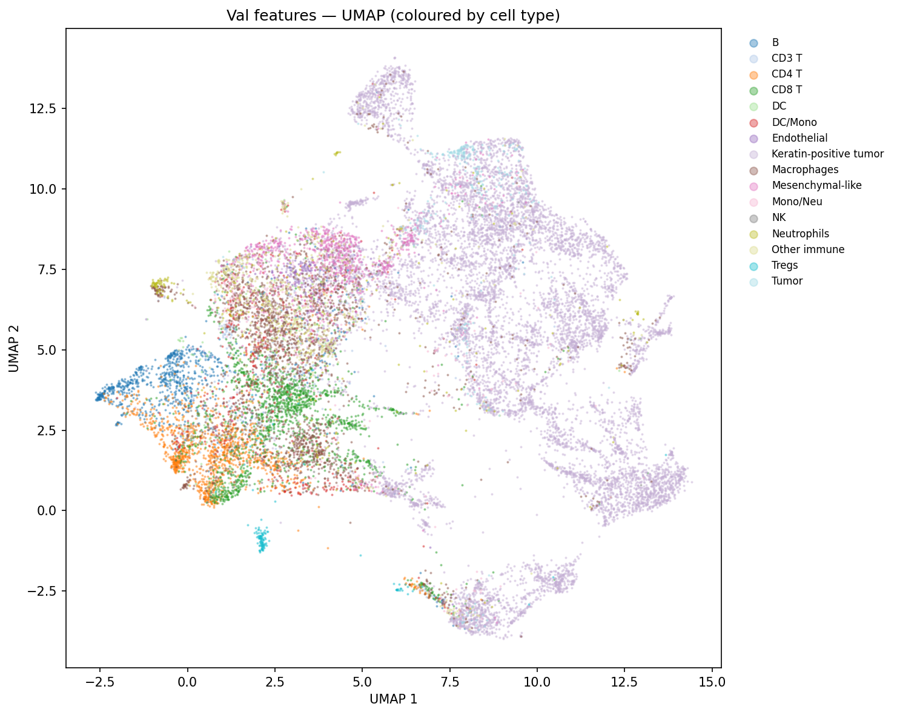
*UMAP of CIM embeddings, MIBI_TNBC (coloured by cell type)*

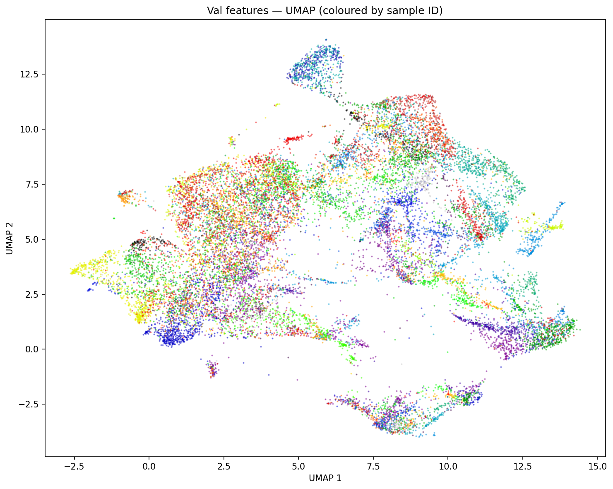
*UMAP of CIM embeddings, MIBI_TNBC (coloured by patient sample — checks for batch effect)*

| Model | LP Bal. Acc | kNN Bal. Acc | NMI | ARI | Silhouette | Neigh. Purity |
|-------|------------|-------------|-----|-----|-----------|--------------|
| CIM | 0.8446 | 0.5780 | 0.274 | 0.107 | −0.094 | 0.711 |
| **CIM_Norm** | 0.8386 | **0.5802** | 0.321 | 0.126 | **+0.002** | 0.727 |
| CIM_ProgFusion | 0.8297 | 0.5714 | **0.332** | **0.142** | +0.001 | **0.728** |
| EarlyFusion32 | 0.8371 | 0.4458 | 0.206 | 0.075 | −0.205 | 0.653 |
| ResNet | 0.5925 | 0.3963 | 0.222 | 0.069 | −0.151 | 0.631 |
| CIMATT_Gate | **0.8454** | 0.5598 | 0.306 | 0.121 | −0.088 | 0.706 |
| CIMATT_Gate_LowAug | 0.8476 | 0.5861 | 0.300 | 0.143 | −0.082 | 0.723 |

**UMAP examples:**

| CIM | CIM_Norm | CIM_ProgFusion |
|-----|----------|----------------|
|  | 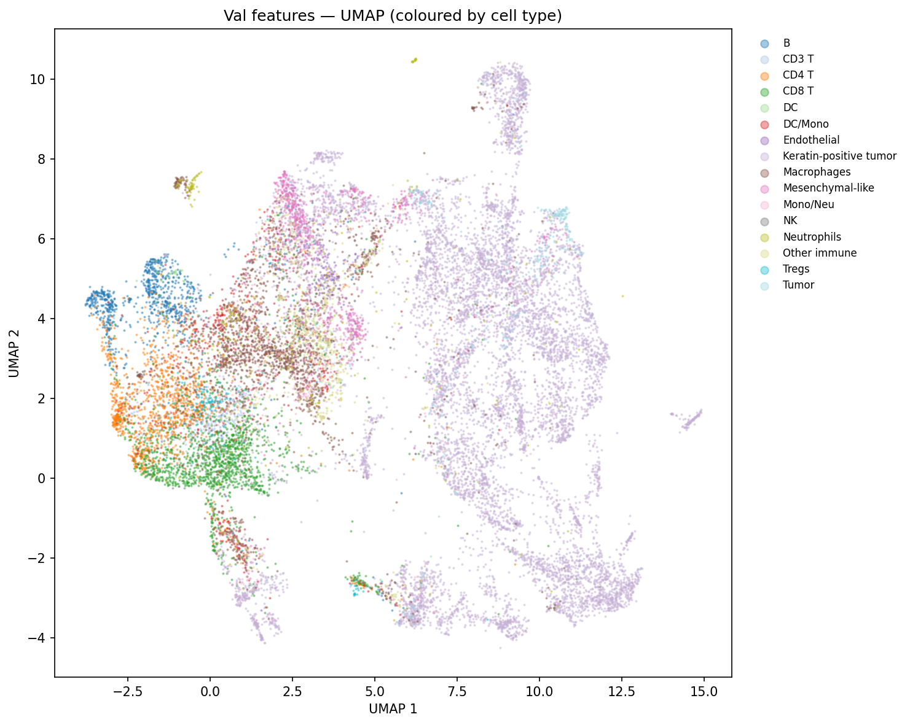 | 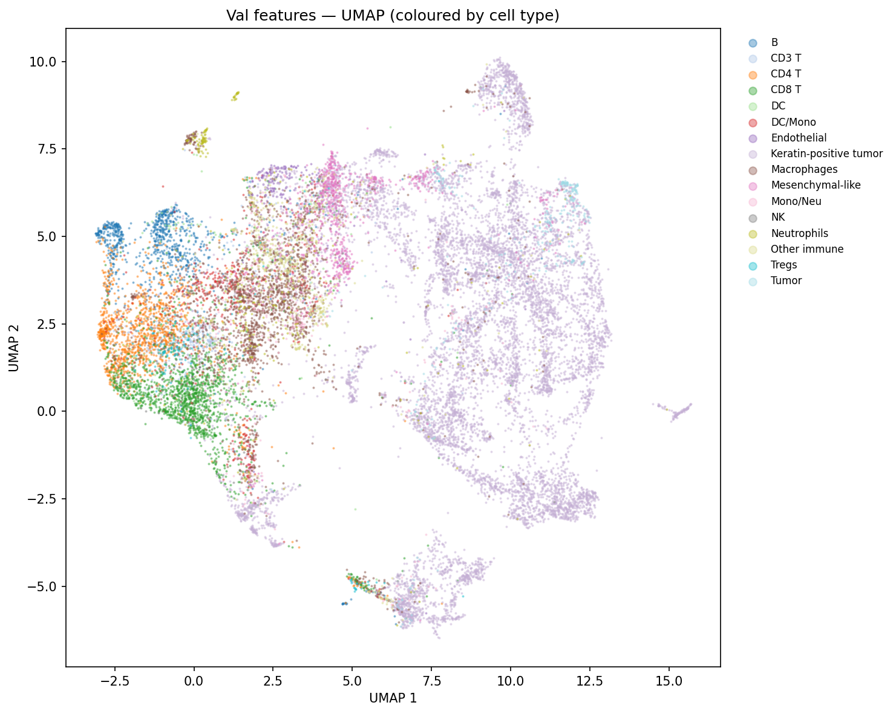 |

| EarlyFusion32 | ResNet | CIMATT_Gate |
|---------------|--------|-------------|
| 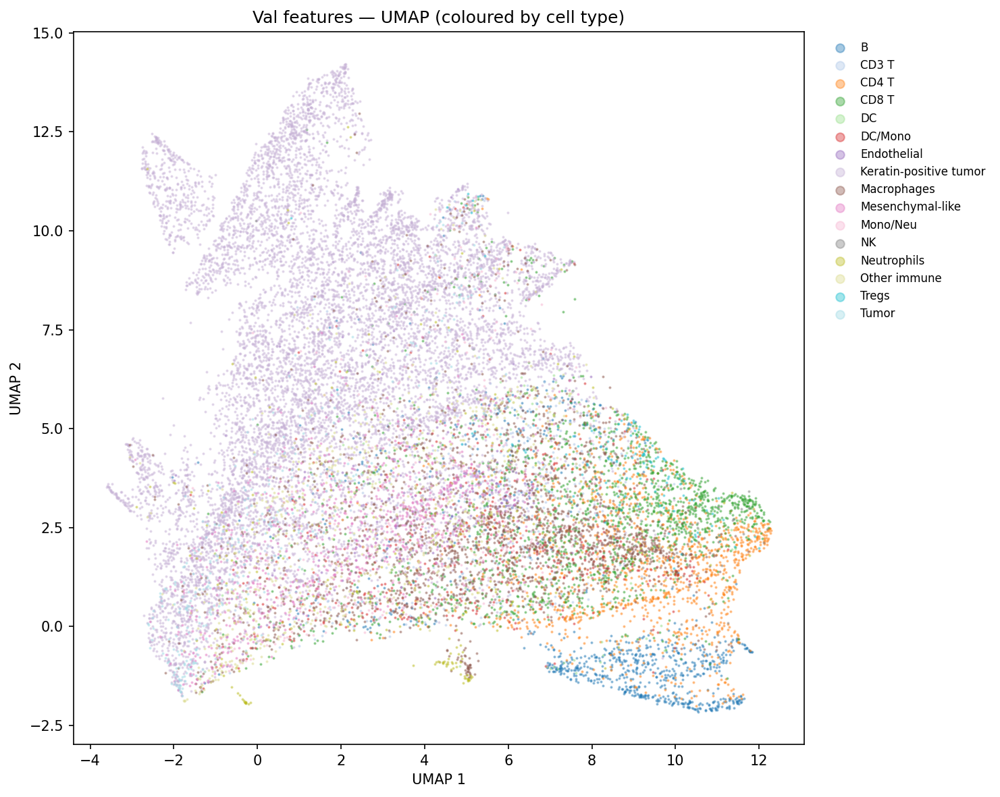 | 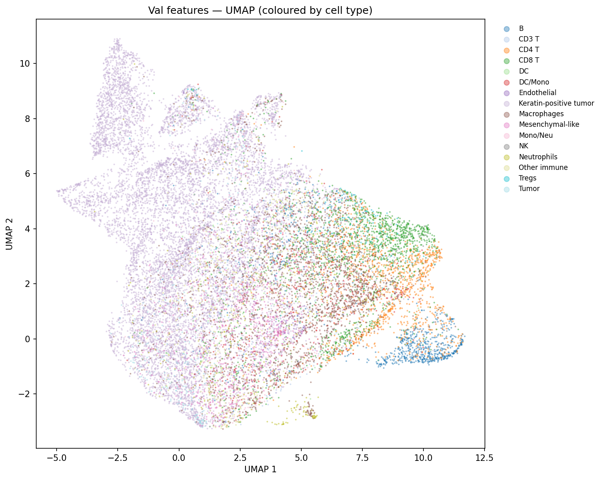 | 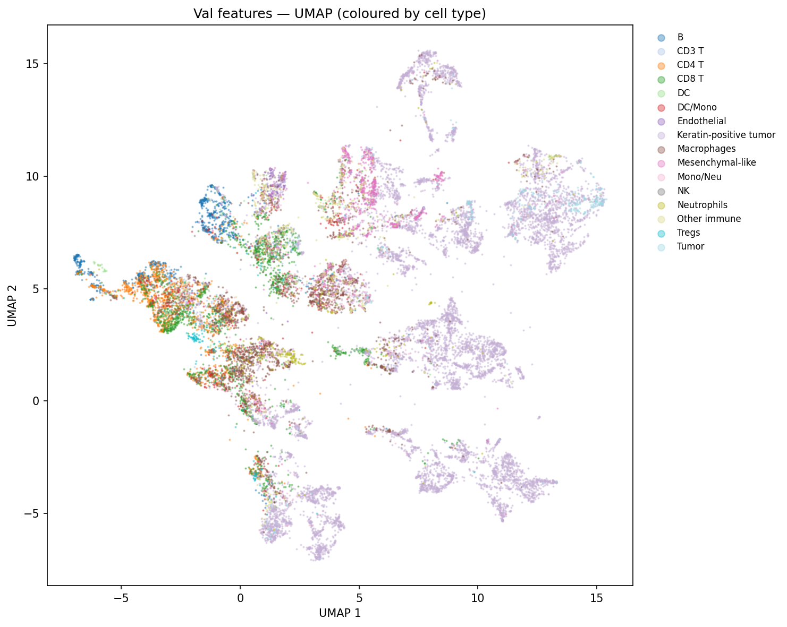 |

**Key observations:**
- CIM_Norm and CIM_ProgFusion both push the silhouette to near zero (+0.002, +0.001), confirming that input normalisation is the critical ingredient for sample-invariant embeddings on MIBI_TNBC.
- EarlyFusion32 has the second-worst silhouette (−0.205) despite competitive linear probe accuracy (0.837). Its UMAP is strongly fragmented by sample, confirming that cross-channel mixing encodes absolute intensities.
- ResNet collapses to 59.3% balanced accuracy — the worst LP on MIBI_TNBC — but its cross-channel mixing from layer 1 produces a silhouette (−0.151) better than EarlyFusion (−0.205). This is the "relative features" effect: ResNet's mixed convolutions encode co-expression ratios that are partially sample-invariant.
- **CIMATT_Gate** achieves the highest raw LP accuracy (84.5–84.8%), but its silhouette (−0.088) remains negative. The attention-based gating creates fragmented embedding islands (cells of the same type with different relative expression profiles land in different UMAP islands). The LowAug variant slightly improves geometry (−0.082) while preserving the LP advantage.
- CIM_ProgFusion achieves the best NMI (0.332) and ARI (0.142) of all CIM-family models, matching or exceeding CIMATT_Gate on structure metrics.

---

### MIBI_TNBC Cross-Validation

To estimate generalisation across patient cohorts, 5 sample-level 80/20 cross-validation splits were run on MIBI_TNBC. Each split holds out different patient samples as the validation set. Split configs: `configs/_datasets_/MIBI_TNBC_CV{0-4}.py`. Run scripts: `run_cv.sh`.

Individual split results in `z_RUNS/MIBI_TNBC_CV{0-4}_<MODEL>_VICReg/`.

**CV Mean ± Std (5 splits unless noted):**

| Model | LP Bal. Acc | kNN Bal. Acc | NMI | ARI | Silhouette | Neigh. Purity |
|-------|------------|-------------|-----|-----|-----------|--------------|
| CIM | 0.810 ± 0.013 | 0.531 ± 0.019 | 0.280 ± 0.018 | 0.100 ± 0.020 | −0.082 ± 0.030 | 0.772 ± 0.031 |
| CIM_Norm | 0.809 ± 0.011 | 0.522 ± 0.023 | 0.314 ± 0.016 | 0.134 ± 0.019 | **+0.003 ± 0.024** | 0.781 ± 0.027 |
| **CIM_ProgFusion** | 0.799 ± 0.010 | 0.527 ± 0.024 | **0.333 ± 0.008** | 0.128 ± 0.014 | +0.025 ± 0.018 | **0.786 ± 0.029** |
| EarlyFusion32¹ | **0.804 ± 0.008** | 0.403 ± 0.017 | 0.212 ± 0.003 | 0.073 ± 0.005 | −0.214 ± 0.039 | 0.726 ± 0.019 |

> ¹ EarlyFusion32 CV: n=3 (CV0, CV1, CV2 only; CV3/CV4 not completed).

**Individual CV split results:**

<details>
<summary>CIM — per-split</summary>

| Split | LP Bal. Acc | kNN Bal. Acc | NMI | ARI | Silhouette | Neigh. Purity |
|-------|------------|-------------|-----|-----|-----------|--------------|
| CV0 | `z_RUNS/MIBI_TNBC_CV0_CIM_VICReg/` | | | | | |
| CV1 | `z_RUNS/MIBI_TNBC_CV1_CIM_VICReg/` | | | | | |
| CV2 | `z_RUNS/MIBI_TNBC_CV2_CIM_VICReg/` | | | | | |
| CV3 | `z_RUNS/MIBI_TNBC_CV3_CIM_VICReg/` | | | | | |
| CV4 | `z_RUNS/MIBI_TNBC_CV4_CIM_VICReg/` | | | | | |

</details>

**Key CV observations:**
- **CIM_ProgFusion is the most stable** (smallest LP std: ±0.010) and achieves the best NMI (0.333 ± 0.008, tight) across splits, confirming that its cross-marker fusion generalises well to held-out samples.
- **CIM_Norm silhouette is consistently near zero** (+0.003 ± 0.024), the only model whose embedding geometry is consistently non-negative. This is the clearest evidence that input L2-normalisation solves the inter-sample variation problem.
- **EarlyFusion32 silhouette** (−0.214 ± 0.039) is robustly negative across all splits — the sample fragmentation is not a training artefact but a structural limitation of early-fusion architectures on this dataset.
- LP accuracy gap between CIM (0.810) and CIM_ProgFusion (0.799) is only −1.1pp, while ProgFusion leads on all geometry metrics. The choice depends on the downstream task: LP accuracy → CIM; cluster quality → CIM_ProgFusion.

---

## Key Findings

### 1. Channel separability is the most important inductive bias

Across all 5 datasets, CIM outperforms EarlyFusion on silhouette and linear probe accuracy. The fundamental reason: in multiplexed imaging, cell type identity is defined by **which markers are expressed**, not by their joint spatial pattern. Grouped depthwise convolutions preserve this structure; standard convolutions destroy it.

**CODEX_cHL quantification:** CIM (1.1M params, 1k iters) vs EarlyFusion32 (45M params, 5k iters): CIM wins on LP (+1.7pp), silhouette (−0.003 vs −0.006 at 5k), and training efficiency (45× fewer parameters, 5× fewer iterations). EarlyFusion32 at 5k learns comparably good cluster *structure* (NMI nearly matches CIM) but the clusters are not linearly separable.

### 2. Input L2-normalisation solves inter-sample intensity variation

CIM_Norm (`input_norm=True`) applies `F.normalize(x, dim=1)` before the stem, converting absolute intensity vectors to relative expression profiles. This single change:
- Brings MIBI_TNBC silhouette from −0.094 to +0.002
- Brings MIBI_TNBC NMI from 0.274 to 0.321
- Costs only ~0.6pp on LP accuracy (0.844 → 0.839)

The tradeoff is acceptable for most use cases. For applications requiring maximally linear features (e.g. downstream classification), plain CIM is preferable.

### 3. Progressive fusion is the best geometry model

CIM_ProgFusion achieves the best NMI and ARI across MIBI_TNBC and CODEX_DLBCL. By integrating cross-marker information *gradually* (via injections into a fusion stream at each stage), it avoids the fragmentation of early fusion while capturing co-expression patterns that pure CIM misses in its neck.

On MIBI_TNBC CV: NMI 0.333 ± 0.008, the tightest uncertainty of all models. Its cluster structure is consistent across held-out patient cohorts.

### 4. CIMATT_Gate: higher LP accuracy but fragmented geometry

The marker gating mechanism of CIMATT_Gate achieves the highest linear probe accuracy on MIBI_TNBC (0.845–0.848 full-run). The gates learn to up-weight distinctively expressed markers per cell, providing richer discriminative features for the linear probe.

**However:** The silhouette remains negative (−0.088 vs −0.094 for plain CIM). The root cause is that gating based on relative expression creates a non-smooth embedding manifold: cells of the same type with different relative marker profiles (e.g., from different tissue regions) receive different gate patterns and land in different UMAP islands. Input normalisation (CIM_Norm) is a more robust solution to inter-sample variation.

### 5. ResNet integrates samples "for free" but at LP cost

ResNet achieves better inter-sample integration than EarlyFusion (higher silhouette on most datasets) because its cross-channel convolutions from layer 1 implicitly encode **relative features** (ratios, co-expression patterns) rather than absolute intensities. This makes it partially sample-invariant.

The cost: ResNet achieves the worst linear probe accuracy on datasets with fine-grained cell type distinctions (−10.7pp on CODEX_cHL, −19.7pp on CODEX_DLBCL vs CIM). When cell types differ in a single marker's absolute level, ResNet cannot recover that signal after channel mixing.

### 6. Performance ceilings are panel-limited, not model-limited

**CODEX_cHL:** All models converge to ~72–73% balanced accuracy. Panel inspection reveals FoxP3 (canonical Treg marker) and CD56 (canonical NK marker) are absent due to poor CODEX staining quality. This creates irreducible CD4/TReg and Monocyte/NK confusion matching the KRONOS ViT-Large ceiling (73.6%).

**CODEX_DLBCL:** The 18-class fine-grained annotation (CD4TNaive, TTOX_exh, TFH, etc.) requires markers that may not uniquely define these states in the CODEX panel, pushing all models to ~68–70%.

**Implication:** Improving cell type separability on these datasets requires either a better antibody panel or label consolidation, not better models.

### 7. Linear probe overestimates performance vs kNN

The linear probe consistently outperforms kNN by 15–25pp (e.g., CODEX_cHL: LP 72.5% vs kNN 52.5%). This indicates the embedding geometry is not metric-isotropic: classes are linearly separable but not compact in cosine distance. The linear probe is the correct primary metric. However, for nearest-neighbour based analyses (cell graph construction, spatial queries), kNN accuracy is more informative.

---

## Region Analysis

The CIM backbone (trained on single cells) generalises to tissue region discovery via sliding-window patching. See `notebooks/region_analysis.ipynb`.

**Pipeline:**
1. Extract overlapping spatial patches (ps64: 64×64px, 50% stride; ps128: 128×128px, 50% stride) from full tissue images
2. Embed each patch with the frozen CIM backbone
3. PCA (64 components) → MiniBatchKMeans (k ∈ {2, 4, 8, 12, 16})
4. Interpret clusters by the cell-type composition within each patch

**Results on CODEX_cHL (k=8, ps64):**

| Cluster | Top cell types | Interpretation |
|---------|---------------|----------------|
| Dense tumour | Tumor 41–49%, DC 11%, NK 9% | Reed-Sternberg cell niche |
| Tumour-immune border | Tumor 17–20%, NK 17%, DC 13% | Tumour-infiltrating immune zone |
| B follicle | B 35%, CD4 26% | B cell follicle with follicular helper T cells |
| CD4 T zone | CD4 38%, CD8 17–19% | T cell-rich interfollicular area |
| NK/Monocyte | CD4 30%, NK 11%, Monocyte 10% | Innate immune-enriched area |
| Stromal/M2 | Other 21–23%, M2 14%, CD4 20% | Stromal + M2 macrophage regions |

Results stored at `z_RUNS/region_analysis/ps{PATCH_SIZE}/k_{k}/umap.png`.

**Key finding:** The tumour/lymphoid dichotomy is recovered robustly at k=2 and persists across all k values and both patch sizes. B-cell follicle structure (B + CD4/TFH) appears from k≥4. At k=8, distinct innate immune, vascular, and stromal compartments are discriminated. The CIM features trained on single cells transfer to patch-level tissue organisation.

---

## How to Run

### Prerequisites

```bash
pip install torch mmengine scikit-learn umap-learn h5py numpy
```

### Running a single experiment

```bash
python -m mmengine.runner configs/_experiments_/MIBI_TNBC/CIM_VICReg.py
```

Or with a custom work_dir:

```bash
python -m mmengine.runner configs/_experiments_/MIBI_TNBC/CIM_VICReg.py \
    --cfg-options work_dir=z_RUNS/MY_RUN
```

### Running all backbones for a dataset

```bash
bash run_experiments.sh MIBI_TNBC       # runs CIM, CIM_Norm, CIM_ProgFusion, EarlyFusion32, ResNet
bash run_experiments.sh CODEX_cHL
bash run_experiments.sh IMC_NB
```

### Running cross-validation splits

```bash
bash run_cv.sh MIBI_TNBC               # runs CV0–CV4 for CIM, CIM_Norm, CIM_ProgFusion, EarlyFusion32
```

### Debugging (fast mode)

```bash
DEBUG=1 python -m mmengine.runner configs/_experiments_/MIBI_TNBC/CIM_VICReg.py
```

Sets `n_linear=5, n_cosine=5` (10 total iterations) for quick sanity checks.

### Configuration system

Configs use mmengine's inheritance (`_base_`). The hierarchy is:

```
_experiments_/DATASET/MODEL_ALGO.py
    ├── _base_/default.py
    ├── _augmentations_/high.py or low.py
    ├── _base_/train_cfg.py
    ├── _base_/val_cfg.py
    ├── _datasets_/DATASET.py
    ├── _backbones_/MODEL.py
    └── _algorithms_/ALGO.py
```

To create a new experiment, copy an existing config from `configs/_experiments_/` and modify the `_base_` list and `work_dir`.

---

## Citation / Reference

This codebase was developed for research on self-supervised cell representation learning in multiplexed spatial proteomics. If you use this code, please cite the associated work (see `PUBLICATION_PLAN.md`).
