# MCA — Multi-Channel Cell Analysis

Self-supervised representation learning for multiplexed protein imaging (CODEX, IMC, MIBI-TOF).
We learn compact, label-free cell embeddings from high-plex spatial patches that are discriminative across cell types and stable across tissue samples.

---

## Table of Contents

1. [Project Overview](#project-overview)
2. [Repository Structure](#repository-structure)
3. [Datasets](#datasets)
4. [Model Architectures](#model-architectures)
5. [Training Setup](#training-setup)
6. [Evaluation Metrics](#evaluation-metrics)
7. [Results](#results)
   - [Summary](#summary)
   - [CODEX cHL KRONOS18](#codex_chl_kronos18)
   - [CODEX cHL Full Panel](#codex_chl-full-panel)
   - [CODEX DLBCL](#codex_dlbcl)
   - [IMC NB TumorSub](#imc_nb_tumorsub)
   - [MIBI TNBC](#mibi_tnbc)
   - [Panel Size: Less Is More](#panel-size-less-is-more)
   - [Label Efficiency](#label-efficiency)
8. [Key Findings](#key-findings)
9. [How to Run](#how-to-run)

---

## Project Overview

In multiplexed tissue imaging, each cell is measured across tens of protein markers simultaneously. A single tissue section can contain hundreds of thousands of cells spanning many functionally distinct types — tumour cells, T cell subtypes, macrophages, endothelial cells, and more.

The central challenge: **absolute marker intensities vary dramatically between samples** (staining batch, tissue processing, patient variability), but **relative expression profiles encode cell identity**. A CD8 T cell from patient A and patient B will have different absolute CD8 intensities, yet both express CD8 high relative to other markers.

We frame this as a self-supervised learning problem: can a neural network learn to represent cells purely from their spatial protein expression patches, without any labels, such that cells of the same type cluster together while cells of different types are well-separated — and crucially, that these clusters are stable across patients?

The core architectural question is **how to process the C channels** (one per antibody marker):

| Strategy | Architecture | Inductive Bias |
|---|---|---|
| **Late fusion** (channel-independent) | CIM, CIM_ProgFusion | Each marker processed independently; cross-channel relations learned late |
| **Early fusion** | EarlyFusion32 | Standard conv mixes channels from first layer; learns cross-marker correlations |
| **Implicit relative features** | ResNet | Large receptive field + deep mixing; implicitly normalises absolute intensities |

---

## Repository Structure

```
MCA/
├── src/
│   ├── models.py              # CIM (WideModel), CIM_ProgFusion (WideModelProgressiveFusion)
│   ├── models_early_fusion.py # EarlyFusionModel
│   ├── VICReg.py              # MVVICReg training objective
│   ├── val_hook_rich.py       # EvaluateModelRich — LP, kNN, clustering, silhouette, label efficiency
│   └── val_hook.py            # Legacy evaluation hook
├── configs/
│   ├── _base_/                # Default training, val, and augmentation configs
│   ├── _datasets_/            # Per-dataset configs (paths, n_markers, patch_size)
│   ├── _backbones_/           # Backbone architecture configs
│   ├── _algorithms_/          # VICReg loss configs
│   └── _experiments_/
│       └── paper/             # Paper experiment configs (5 datasets × 4 models)
├── tools/
│   ├── label_efficiency.py    # Standalone label efficiency curve tool
│   └── plot_loss.py           # Training loss curve visualisation
├── docs/figures/              # All generated comparison figures (PDF + PNG)
├── run_paper.sh               # Run all 20 paper experiments sequentially
├── z_RUNS/paper/              # Results output directory
│   └── <DATASET>/<MODEL>/     # metrics.json, umap.pdf, confusion_matrix.pdf, ...
└── journal.md                 # Experiment log and paper narrative
```

---

## Datasets

All datasets consist of multiplexed protein imaging of tumour tissue sections. Each cell is represented as a small square patch centred on the cell centroid, with one channel per antibody marker.

### CODEX cHL KRONOS18

| Property | Value |
|---|---|
| Modality | CODEX (co-detection by indexing) |
| Disease | Classical Hodgkin Lymphoma (cHL) |
| Markers | 18 (curated KRONOS18 panel: CD3, CD4, CD8, CD20, CD30, FoxP3, CD68, PDPN, etc.) |
| Cell types | 17 (B, CD4, CD8, Cytotoxic CD8, DC, Endothelial, Epithelial, Lymphatic, M1, M2, Mast, Monocyte, NK, Neutrophil, Other, TReg, Tumor) |
| Patch size | 32 × 32 px (eval crop: 18 × 18 px) |
| Train / Val | ~100k / ~14k cells |

The KRONOS18 panel is a clinically motivated 18-marker selection covering the main immune and structural compartments of cHL. FoxP3 (TReg marker) and key myeloid markers are included.

### CODEX cHL Full Panel

| Property | Value |
|---|---|
| Modality | CODEX |
| Disease | Classical Hodgkin Lymphoma (cHL) |
| Markers | **41** (full staining panel) |
| Cell types | 17 (same as KRONOS18) |
| Patch size | 32 × 32 px (eval crop: 18 × 18 px) |
| Train / Val | ~100k / ~14k cells |

Same cohort as KRONOS18 but with all 41 measured markers. The 23 additional markers include redundant channels, isotype controls, and markers with limited biological signal for the 17-class annotation.

### CODEX DLBCL

| Property | Value |
|---|---|
| Modality | CODEX |
| Disease | Diffuse Large B-Cell Lymphoma (DLBCL) |
| Markers | 40 |
| Cell types | **18** (including fine T cell subtypes: TFH, TTOX, TTOXNaive, TTOX_exh, NKT, TPR) |
| Patch size | 24 × 24 px (eval crop: 12 × 12 px) |
| Train / Val | ~364k / ~52k cells |

The largest and hardest dataset. Fine T cell subtypes (exhausted, naive, follicular helper) are annotated — these overlap heavily in protein space and present a significant challenge. DLBCL is a B cell malignancy, making B cells the most abundant and most easily identified type.

### IMC NB TumorSub

| Property | Value |
|---|---|
| Modality | Imaging Mass Cytometry (IMC) |
| Disease | Neuroblastoma (NB) |
| Markers | 31 |
| Cell types | **19** (immune + stromal types + 11 tumour cell subtypes: TC_CD24pos, TC_CD24neg, TC_CD44, TC_CHGAhi, TC_CXCR4hi, TC_GATA3hi, TC_GD2lo, TC_bridge, TC_early, Proliferating, Progenitor) |
| Patch size | 24 × 24 px (eval crop: 12 × 12 px) |
| Train / Val | ~240k / ~30k cells |

IMC has lower spatial resolution than CODEX (~1 µm/px vs ~0.5 µm/px) and typically captures 30+ metal-conjugated markers in a single scan. The fine tumour subtype annotation makes this a challenging intra-tumour heterogeneity benchmark.

### MIBI TNBC

| Property | Value |
|---|---|
| Modality | Multiplexed Ion Beam Imaging (MIBI-TOF) |
| Disease | Triple-Negative Breast Cancer (TNBC) |
| Markers | 37 |
| Cell types | 16 (including Keratin+ tumour, Mesenchymal-like, Tregs, CD8 T, DC/Mono, Mono/Neu) |
| Patch size | 32 × 32 px (eval crop: 20 × 20 px) |
| Train / Val | ~196k / ~44k cells |
| Patients | 40 (5-fold cross-validation available) |

The MIBI_TNBC dataset is the most heterogeneous in terms of patient-level variability. Cross-patient generalisation is the primary challenge. The highest LP balanced accuracies across all datasets are achieved here, reflecting a relatively clean marker-to-cell-type mapping (Pan-Keratin for tumour, FoxP3 for Tregs, etc.).

---

## Model Architectures

All models take an input patch of shape `[B, C, H, W]` where `C` is the number of markers and produce a flat embedding vector fed into a VICReg projection head.

### CIM — Channel-Independent Model

The core design principle: **process each marker channel independently** using grouped (depthwise) convolutions, then pool across spatial and channel dimensions.

```
Input:  [B, C, H, W]
        ↓  C independent conv streams (grouped conv, groups=C)
        ↓  stem_width=32 feature maps per marker
        ↓  spatial pooling
        ↓  flatten → [B, C × 32]  (= feature_dim)
        ↓  VICReg neck (MLP projector)
```

Each marker's spatial pattern is summarised independently. Cross-marker relationships are learned only in the MLP neck and the downstream linear probe, not inside the backbone. This is the key inductive bias: cell identity is determined by the *pattern* of each marker independently, not by arbitrary co-expression mixtures.

**Why this works for multiplexed imaging:** Absolute intensities vary across patients, but each marker's local spatial distribution (is this cell bright? does it show membrane vs cytoplasmic staining?) is robust. Keeping channels independent prevents batch effects in one marker from leaking into representations of other markers.

- Backbone: `WideModel` in `src/models.py`
- Config: `configs/_backbones_/CIM.py`
- Feature dim: `n_markers × stem_width` (e.g. 41 × 32 = 1312 for cHL full panel)

### CIM_ProgFusion — Progressive Fusion

A dual-branch extension of CIM that **gradually introduces cross-marker communication** through stages. A "fusion stream" runs in parallel to the CIM stream; at each stage, CIM features are injected into the fusion stream via learned mixing.

```
Input:  [B, C, H, W]
        ↓
  CIM branch (grouped conv, channel-independent)
  + Fusion branch (standard conv, cross-channel)
        ↓  injection at each stage
        ↓  spatial pooling of both branches
        ↓  concatenate → [B, C × features_per_marker]
        ↓  VICReg neck
```

The key idea: early layers remain channel-independent (preserving marker identity), while later layers can learn cross-channel dependencies. This produces richer cluster structure (higher NMI/ARI) at a modest cost to linear probe accuracy.

- Backbone: `WideModelProgressiveFusion` in `src/models.py`
- Config: `configs/_backbones_/CIM_ProgFusion.py`
- Optimal config (from sweep): `stem_width=32, block_width=2, layer_config=[1,1]`

### EarlyFusion32

Standard convolutional architecture where channels are mixed from the **first layer**. The stem uses a regular `Conv2d(C, 32, 3, 1, 1)` rather than grouped convolutions.

```
Input:  [B, C, H, W]
        ↓  Conv2d(C → 32) — all channels mixed immediately
        ↓  WideResNet-style blocks
        ↓  global average pool → [B, feature_dim]
        ↓  VICReg neck
```

Early mixing allows the model to learn cross-marker co-expression patterns from the first layer. However, this also means it is sensitive to absolute intensity scales — if marker A is always 2× brighter in sample 1 vs sample 2, the model cannot distinguish this from a genuinely different cell state.

- Backbone: `EarlyFusionModel` in `src/models_early_fusion.py`
- Config: `configs/_backbones_/EarlyFusion32.py`

### ResNet

A standard ResNet backbone adapted for multi-channel input. Uses `base_width=64` and a fixed neck output dimension of 256.

```
Input:  [B, C, H, W]
        ↓  ResNet stem (Conv2d(C → 64))
        ↓  4 residual stages with downsampling
        ↓  global average pool → [B, 256]
        ↓  VICReg neck
```

The ResNet's deep architecture and large receptive field means it implicitly computes *relative* features (contrast between regions), which offers some protection against absolute intensity batch effects. However, its small output dimensionality (256 vs 1000+ for CIM/ProgFusion) limits fine-grained discrimination.

- Config: `configs/_backbones_/ResNet.py`
- Feature dim: 256 (fixed)

---

## Training Setup

### Algorithm: VICReg

We use **Variance-Invariance-Covariance Regularisation (VICReg)** as the self-supervised objective. Given two augmented views of the same cell patch, the loss encourages:

- **Invariance** (`loss_inv`, weight=25): the embeddings of both views should be similar
- **Variance** (`loss_var`, weight=25): each dimension of the embedding should have unit variance across the batch (prevents collapse)
- **Covariance** (`loss_cov`, weight=1): different dimensions should be decorrelated (prevents redundancy)

The two views are generated with different augmentation strengths (strong/weak), both from the same cell centroid.

### Augmentations

Each view is produced by:
1. **Random flip** (horizontal + vertical, p=0.5)
2. **Random affine** (rotation 0–360°, scale 0.8–1.2)
3. **Random channel shift/scale** (per-marker intensity jitter)
4. **Random Gaussian noise** (std 0–0.02)
5. **Random channel drop** (drop_prob=0.1 — randomly zero a marker)
6. **Central crop** to `strong_size` or `weak_size`

Channel drop is particularly important: it forces the model to not rely on any single marker, encouraging representations robust to marker-level dropout (e.g., failed antibody staining).

### Optimiser

| Parameter | Value |
|---|---|
| Optimiser | LARS (Layer-wise Adaptive Rate Scaling) |
| Base LR | 0.3 |
| Momentum | 0.9 |
| Weight decay | 1e-5 |
| Schedule | 400 linear warmup + 3600 cosine annealing |
| Total iterations | 4000 |
| Batch size | 512 (256 for CIM_ProgFusion on cHL 41-marker) |

LARS is used instead of Adam/AdamW because it scales the learning rate per-layer by the ratio of gradient norms, which is critical for stable training of the grouped conv architecture where different layers have very different gradient magnitudes.

### Evaluation

After training, a full evaluation is run (no gradient):
- Features are extracted for all train and val cells
- Linear probe (logistic regression, L-BFGS, C=1, tol=1e-6, max_iter=2000)
- k-NN classification (k=15)
- k-Means clustering (k = n_classes, 10 random seeds)
- Cosine silhouette score (10,000 randomly sampled cells)
- Neighbourhood purity (for each cell, what fraction of the 15 nearest neighbours share its label)
- Label efficiency curve (LP at 10, 50, 100, 200, 1000 cells per class + full LP)
- UMAP (coloured by cell type and by sample ID)

All paper results are in `z_RUNS/paper/<DATASET>/<MODEL>/metrics.json`.

---

## Evaluation Metrics

| Metric | What it measures | Higher = better? |
|---|---|---|
| **LP balanced accuracy** | Linear separability of learned features; balanced across classes | Yes |
| **Mean AP (MAP)** | Area under per-class precision-recall curves, averaged | Yes |
| **kNN balanced accuracy** | Non-parametric class separability | Yes |
| **NMI** | Normalised Mutual Information between cluster assignments and ground truth | Yes |
| **ARI** | Adjusted Rand Index — cluster quality corrected for chance | Yes |
| **Cosine silhouette** | Geometric compactness of cell-type clusters in embedding space | Yes (positive = compact) |
| **Neighbourhood purity** | For each cell, fraction of 15 nearest neighbours sharing same label | Yes |

**LP balanced accuracy vs MAP:** LP balanced accuracy weights all classes equally but is threshold-dependent. MAP integrates over the full ranking and is more sensitive to rare classes — a model can have good LP but poor MAP if it ranks rare-class cells inconsistently.

---

## Results

### Summary

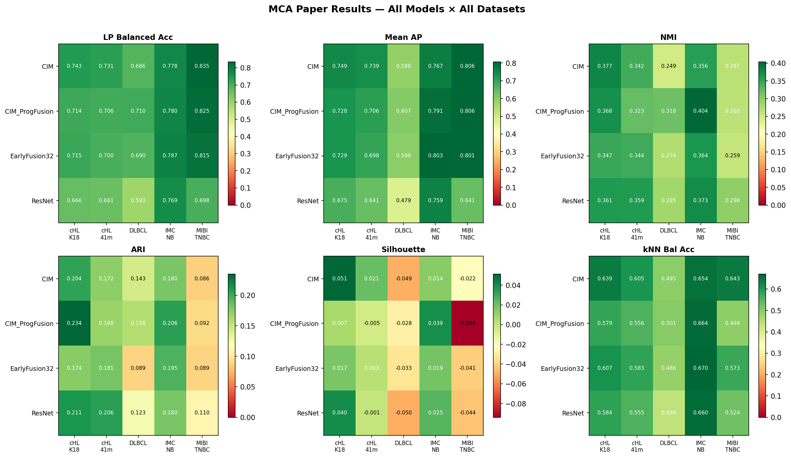

*Figure 1: All six evaluation metrics across all model–dataset combinations. Colour scale is per-metric (green = better). Values overlaid.*

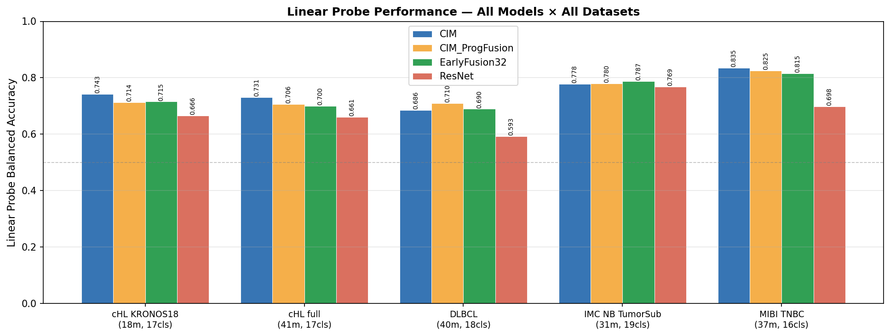

*Figure 2: Linear probe balanced accuracy per dataset (main discriminative metric). Higher is better.*

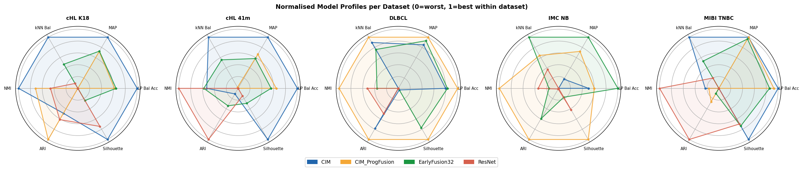

*Figure 7: Normalised model profiles per dataset. Each axis is normalised within the dataset (0 = worst model, 1 = best). Shows which model has the most balanced profile.*

---

### CODEX_cHL_KRONOS18

**18-marker curated panel, 17 cell types, ~115k cells (cHL)**

| Model | LP bal acc | MAP | kNN bal | NMI | ARI | Silhouette |
|---|---|---|---|---|---|---|
| **CIM** | **0.743** | **0.749** | **0.639** | **0.377** | 0.204 | **+0.051** |
| EarlyFusion32 | 0.716 | 0.729 | 0.607 | 0.347 | 0.174 | +0.017 |
| CIM_ProgFusion | 0.714 | 0.728 | 0.579 | 0.368 | **0.235** | +0.007 |
| ResNet | 0.666 | 0.675 | 0.584 | 0.361 | 0.211 | +0.040 |

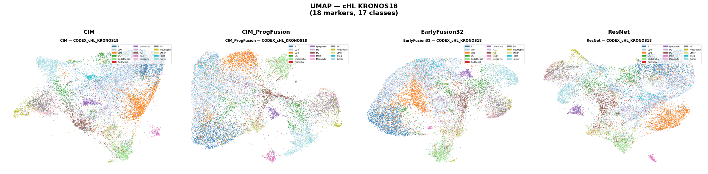

*UMAP embeddings coloured by cell type — all four models on CODEX_cHL_KRONOS18. CIM shows the most compact, well-separated clusters.*

CIM leads across all primary metrics. All four models produce positive silhouette scores — the KRONOS18 panel is well-suited to self-supervised learning, with clusters that are geometrically compact in embedding space.

CIM_ProgFusion achieves the best ARI (0.235), suggesting its dual-branch fusion finds cleaner cluster boundaries despite slightly lower LP accuracy. ResNet's silhouette (0.040) is second-highest, consistent with its tendency to produce smooth, integrated geometry at the cost of LP discrimination.

**Hardest classes:** M1 macrophage (AP ≈ 0.52 across all models), Monocyte (AP ≈ 0.58), Other (AP ≈ 0.55). TReg is well-resolved on KRONOS18 (CIM AP = 0.823) thanks to the inclusion of FoxP3.

---

### CODEX_cHL Full Panel

**41-marker full panel, 17 cell types, ~115k cells (same cohort as KRONOS18)**

| Model | LP bal acc | MAP | kNN bal | NMI | ARI | Silhouette |
|---|---|---|---|---|---|---|
| **CIM** | **0.731** | **0.739** | **0.605** | 0.342 | 0.172 | **+0.021** |
| CIM_ProgFusion | 0.706 | 0.706 | 0.556 | 0.323 | 0.168 | −0.005 |
| EarlyFusion32 | 0.700 | 0.698 | 0.583 | **0.344** | **0.181** | +0.003 |
| ResNet | 0.661 | 0.641 | 0.555 | 0.359 | 0.206 | −0.001 |

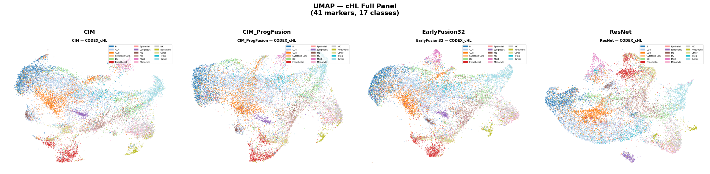

*UMAP embeddings coloured by cell type — all four models on CODEX_cHL (41-marker full panel). Compare with KRONOS18 above: cluster separation is visibly reduced.*

See [Panel Size: Less Is More](#panel-size-less-is-more) for direct KRONOS18 vs full-panel comparison.

**Notable:** CIM_ProgFusion silhouette turns negative on the 41-marker panel (−0.005), while it was positive on KRONOS18 (+0.007). The 23 additional markers appear to add noise that disrupts the fusion branch's ability to form coherent clusters.

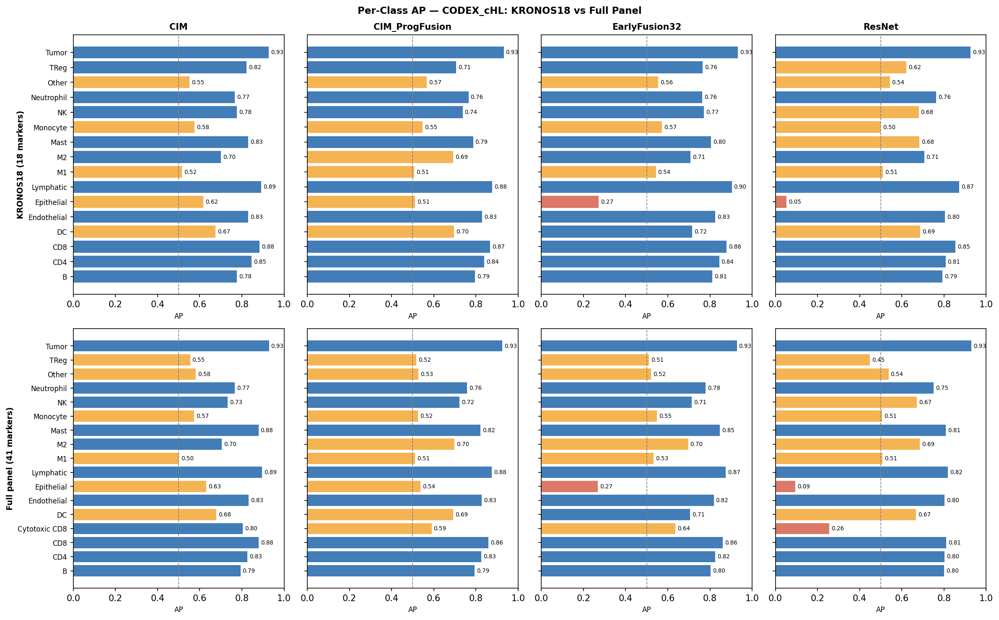

*Figure 9: Per-class AP on KRONOS18 (top row) vs full 41-marker panel (bottom row). The TReg rescue on KRONOS18 is the most striking difference.*

---

### CODEX_DLBCL

**40-marker panel, 18 cell types including fine T cell subtypes, ~416k cells**

| Model | LP bal acc | MAP | kNN bal | NMI | ARI | Silhouette |
|---|---|---|---|---|---|---|
| **CIM_ProgFusion** | **0.710** | **0.607** | **0.501** | **0.319** | **0.158** | **−0.028** |
| EarlyFusion32 | 0.690 | 0.598 | 0.486 | 0.274 | 0.089 | −0.033 |
| CIM | 0.686 | 0.588 | 0.495 | 0.249 | 0.143 | −0.049 |
| ResNet | 0.593 | 0.479 | 0.436 | 0.285 | 0.123 | −0.050 |

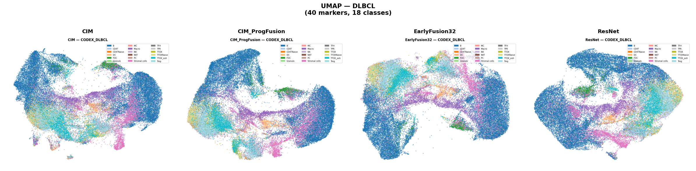

*UMAP embeddings coloured by cell type — all four models on CODEX_DLBCL. Note the fragmented cluster structure (reflected in the universally negative silhouette scores).*

**DLBCL is the hardest dataset** by a significant margin. All models produce negative silhouette scores — the embedding space is fragmented. MAP values (0.48–0.61) are far below other datasets because the fine T cell subtypes are almost indistinguishable from protein expression alone.

**CIM_ProgFusion is the best model here** — the only dataset where it leads on LP. The dual-branch cross-channel fusion appears to capture the subtle co-expression signatures needed to distinguish TFH, TTOX, TTOX_exh, and NKT cells.

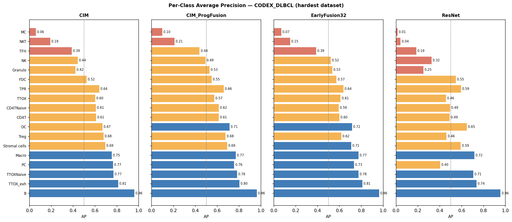

*Figure 5: Per-class AP on CODEX_DLBCL for all four models, sorted by class difficulty. Blue = AP ≥ 0.70, orange = 0.40–0.70, red < 0.40.*

**Hardest classes (all models):**

| Class | CIM AP | CIM_PF AP | EF32 AP | ResNet AP | n_cells |
|---|---|---|---|---|---|
| B | 0.959 | 0.962 | 0.965 | 0.931 | 27,421 |
| TTOX_exh | 0.813 | 0.804 | 0.818 | 0.674 | 3,322 |
| TFH | 0.388 | 0.438 | 0.417 | 0.328 | 592 |
| NKT | 0.191 | 0.210 | 0.193 | 0.126 | 134 |
| MC | 0.059 | 0.098 | 0.065 | 0.063 | 43 |

MC (43 cells) and NKT (134 cells) are near-random for all models. These rare subtypes may require more specific markers not present in the 40-plex panel.

---

### IMC_NB_TumorSub

**31-marker IMC panel, 19 cell types (8 immune/stromal + 11 tumour subtypes), ~240k cells**

| Model | LP bal acc | MAP | kNN bal | NMI | ARI | Silhouette |
|---|---|---|---|---|---|---|
| **EarlyFusion32** | **0.787** | **0.804** | **0.670** | 0.364 | 0.195 | +0.019 |
| CIM_ProgFusion | 0.780 | 0.791 | 0.664 | **0.404** | **0.206** | **+0.039** |
| CIM | 0.778 | 0.767 | 0.654 | 0.356 | 0.180 | +0.014 |
| ResNet | 0.769 | 0.759 | 0.660 | 0.373 | 0.180 | +0.025 |

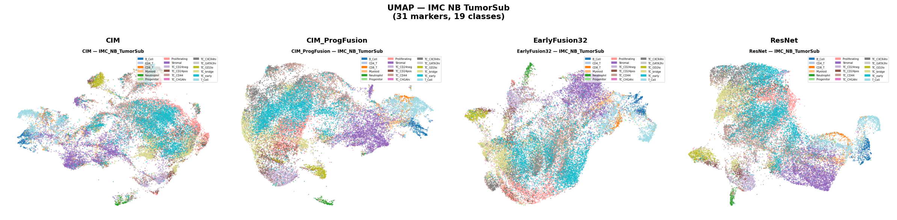

*UMAP embeddings coloured by cell type — all four models on IMC_NB_TumorSub. CIM_ProgFusion shows the clearest intra-tumour subtype separation (best NMI/ARI).*

**IMC_NB_TumorSub is the only dataset where EarlyFusion32 leads on LP and MAP.** The 11 tumour subtypes (TC_CD24pos, TC_CD24neg, TC_CD44, TC_CHGAhi, TC_CXCR4hi, TC_GATA3hi, TC_GD2lo, TC_bridge, TC_early, Proliferating, Progenitor) are distinguished primarily by co-expression patterns — early cross-channel mixing appears beneficial for this task.

**CIM_ProgFusion achieves the best NMI (0.404) and ARI (0.206) and silhouette (+0.039)** — the best clustering geometry of any model on any dataset. This suggests that for fine-grained intra-tumour subtyping, the progressive fusion strategy produces the cleanest, most structured representation.

All models are competitive and close (LP range: 0.769–0.787), consistent with IMC providing a relatively clean marker-to-cell-type mapping for neuroblastoma subtypes.

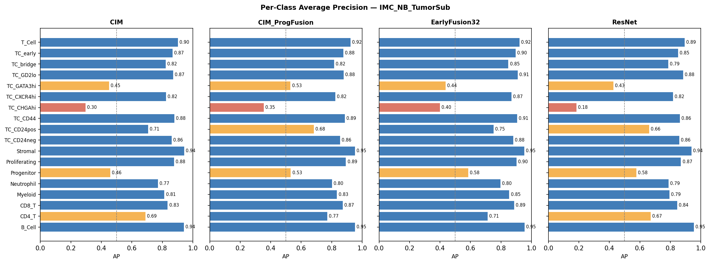

*Figure 8: Per-class AP on IMC_NB_TumorSub. Tumour subtypes (TC_*) show wide variation; immune/stromal types (B_Cell, T_Cell, Stromal) are well-resolved.*

**Hardest classes:** TC_CHGAhi (0.399), TC_GATA3hi (0.437), Progenitor (0.585) — rare tumour subtypes with overlapping marker profiles. Easy classes: B_Cell, Stromal, T_Cell (AP > 0.92 for all models).

---

### MIBI_TNBC

**37-marker MIBI panel, 16 cell types, ~196k cells, 40 patients**

| Model | LP bal acc | MAP | kNN bal | NMI | ARI | Silhouette |
|---|---|---|---|---|---|---|
| **CIM** | **0.835** | **0.806** | **0.643** | 0.267 | 0.086 | **−0.022** |
| CIM_ProgFusion | 0.825 | 0.806 | 0.494 | 0.265 | 0.092 | −0.094 |
| EarlyFusion32 | 0.815 | 0.801 | 0.573 | 0.259 | 0.089 | −0.041 |
| ResNet | 0.699 | 0.641 | 0.524 | **0.296** | **0.110** | −0.044 |

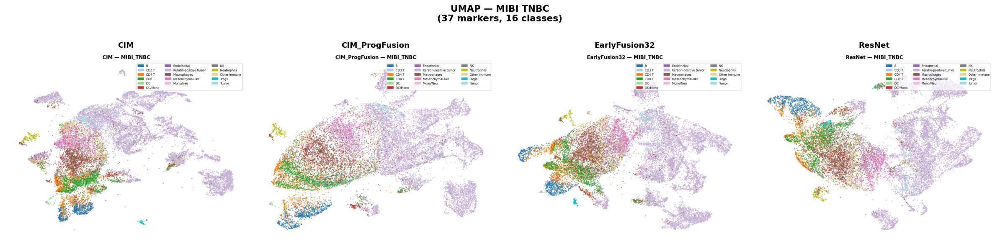

*UMAP embeddings coloured by cell type — all four models on MIBI_TNBC. The patient-driven fragmentation (negative silhouette) is visible in the discontinuous cluster structure.*

**MIBI_TNBC has the highest LP balanced accuracies** across all datasets, reflecting a clean marker-to-cell-type mapping (Pan-Keratin for tumour, FoxP3 for Tregs, CD8 for CD8 T cells, etc.). CIM leads at 0.835.

All models have negative silhouette — MIBI patient variability creates fragmentation in the embedding space. However, the CIM_ProgFusion fragmentation (−0.094) is notably worse than CIM (−0.022), suggesting the fusion branch amplifies cross-patient variation.

ResNet has the best NMI (0.296) and ARI (0.110) despite the worst LP — consistent with ResNet producing well-integrated, patient-invariant embeddings (implicit relative feature computation) at the cost of discriminative precision.

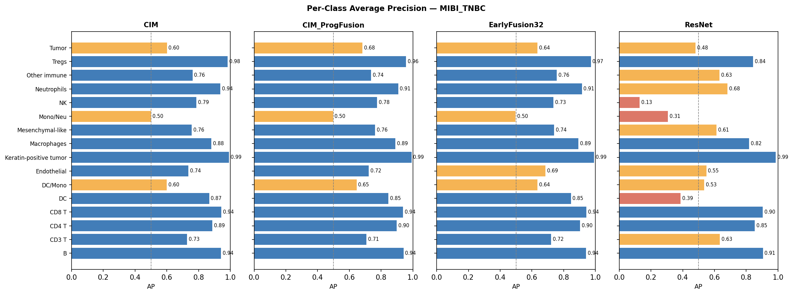

*Figure 6: Per-class AP on MIBI_TNBC. Most classes are well-resolved; Tumor and DC/Mono are the hardest (AP ~0.50–0.60).*

**Hardest classes:** Mono/Neu (0.500), Tumor (0.601), DC/Mono (0.599) — functionally overlapping myeloid populations. Easy classes: Keratin+ tumour (0.991), Tregs (0.983), CD8 T (0.944).

---

### Panel Size: Less Is More

A key finding from the cHL experiments: **reducing the panel from 41 to 18 markers improves all metrics for all models.**

| Model | LP Δ | MAP Δ | NMI Δ | ARI Δ | Sil Δ |
|---|---|---|---|---|---|
| CIM | +0.012 | +0.011 | +0.035 | +0.031 | +0.030 |
| CIM_ProgFusion | +0.007 | +0.022 | +0.045 | +0.066 | +0.011 |
| EarlyFusion32 | +0.015 | +0.031 | +0.003 | −0.007 | +0.014 |
| ResNet | +0.005 | +0.034 | +0.003 | +0.001 | +0.040 |

*Positive = KRONOS18 better. All Δ = KRONOS18 − full panel.*

The most striking single-class difference: **TReg AP on CIM jumps from 0.554 (41-marker) to 0.823 (18-marker)**. The curated panel retains FoxP3 with a higher effective signal-to-noise ratio — the 23 additional channels in the full panel dilute rather than enhance the TReg-specific signal.

This has an important practical implication: **panel curation matters more than panel size**. For self-supervised learning, adding uninformative or noisy markers actively hurts representation quality.

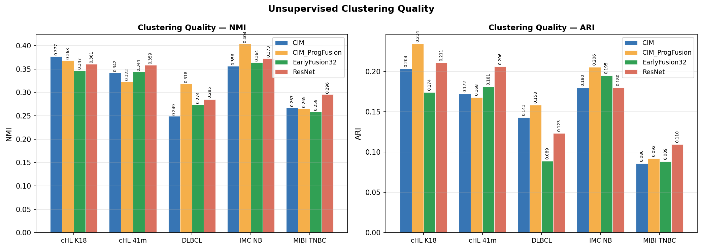

*Figure 3: NMI and ARI across all model–dataset combinations.*

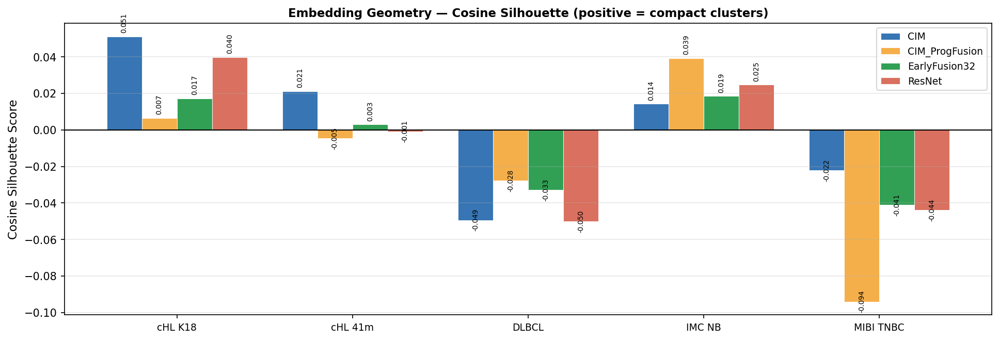

*Figure 4: Cosine silhouette score. Positive = compact cluster geometry; negative = fragmented/overlapping. Note the DLBCL models are universally negative and MIBI_TNBC shows patient-driven fragmentation.*

---

### Label Efficiency

How much labelled data does each model need to reach good performance? We train a linear probe on subsets of training labels in two ways: (1) a fixed number of cells per class, and (2) a fixed fraction of the training set per class.

#### Fixed cells per class (10 → 50 → 100 → 200 → 1000)

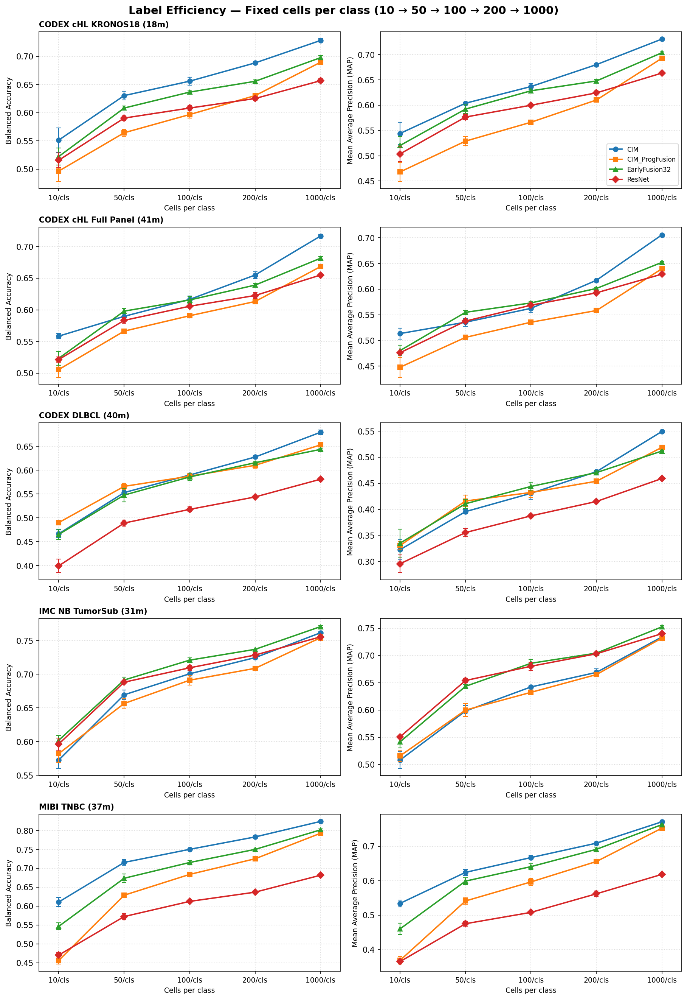

*Figure 10: Label efficiency curves with a fixed number of labelled cells per class (10, 50, 100, 200, 1000). Left column: balanced accuracy; right column: mean AP. Each row is one dataset. Error bars show std across 3 random seeds.*

#### Fraction of training labels (1% → 10% → 100%)

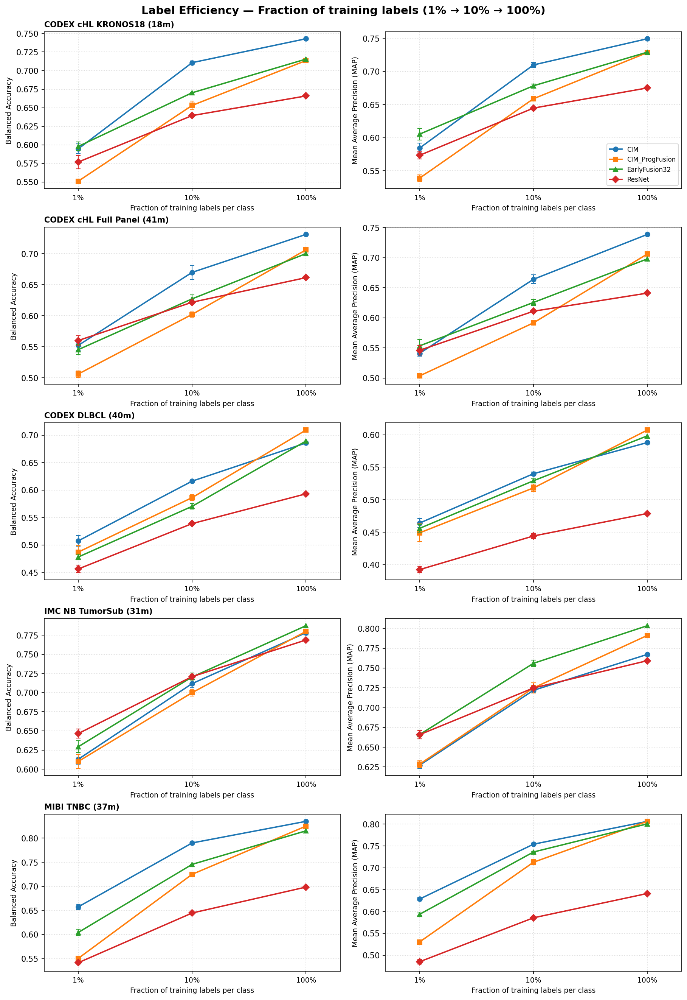

*Figure 11: Label efficiency curves at fixed fractions of per-class training labels (1%, 10%, 100%). Same layout as Figure 10. The fraction view normalises for dataset size, so a 1% point represents different absolute counts across datasets.*

**Key observations:**

- **CIM maintains its lead at all label regimes.** Even at 10 cells per class, CIM representations are the most linearly separable on CODEX_cHL_KRONOS18, CODEX_cHL, and MIBI_TNBC.
- **CIM_ProgFusion is strongest on DLBCL at low labels.** At 10–50 cells/class the cross-channel fusion encodes more structure that is recoverable without many labels.
- **EarlyFusion32 shows the steepest learning curve.** It starts lower at 10 cells/class but catches up at 1000 — it requires more supervision to extract cross-marker co-expression signals.
- **ResNet is consistently weakest** at all label counts, reflecting the information bottleneck of its 256-dimensional output.
- **The fraction view reveals dataset-size effects:** on CODEX_DLBCL (416k cells), 1% per class is ~3,640 cells — far more than on smaller datasets — explaining why the 1% point already yields high accuracy there.

---

## Key Findings

### 1. CIM is the most consistently strong model

CIM leads or ties on LP balanced accuracy on 4 of 5 datasets. Its channel-independent grouped conv design provides a robust inductive bias for multiplexed imaging: each marker is processed as its own feature stream, preventing batch effects from leaking across channels.

### 2. CIM_ProgFusion leads on DLBCL and on clustering metrics

On the hardest dataset (DLBCL, fine T cell subtypes), CIM_ProgFusion's cross-channel fusion is beneficial. It also consistently achieves the best NMI on the IMC_NB_TumorSub dataset (+0.404, best across all models and all datasets). The trade-off vs CIM is approximately −1pp LP but +3–5pp NMI/ARI.

**Use CIM when:** discriminative accuracy (LP) is the priority.
**Use CIM_ProgFusion when:** cluster structure (NMI/ARI, downstream discovery) is the priority, or when fine subtypes require cross-channel co-expression features (DLBCL).

### 3. EarlyFusion32 wins only on IMC_NB_TumorSub LP/MAP

The only dataset where early channel mixing is beneficial is IMC_NB_TumorSub with its fine tumour subtypes. Elsewhere, early fusion either matches or underperforms CIM. Notably, EarlyFusion32 consistently fails on structurally rare classes like Epithelial (AP 0.09–0.27 vs CIM's 0.63) — early mixing loses marker-specific identity needed for low-frequency cell types.

### 4. ResNet: smooth geometry, poor discrimination

ResNet consistently shows near-zero or slightly positive silhouette despite the lowest LP scores. Its deep channel mixing effectively decorrelates cross-patient intensity variation (implicit relative features) but produces coarse, low-resolution representations (feature_dim=256 vs 1000+ for CIM).

### 5. All models fail on M1/M2 macrophage discrimination

M1 macrophage AP is ~0.50 (near chance) on every dataset and every model. M1/M2 polarisation state is functionally defined by cytokine context and is not reliably captured by the protein markers in any of these panels. This is a marker-selection limitation, not an architecture limitation.

### 6. Rare cell types ≤ 100 cells are unreliable

Classes with fewer than ~100 cells (MC=43, Granulo=44 in DLBCL; Cytotoxic CD8=38 in cHL) show erratic AP values. Their per-class metrics should be interpreted with caution.

### 7. Silhouette negativity encodes patient fragmentation

On MIBI_TNBC (40 patients), all models have negative silhouette. UMAPs coloured by patient ID show that the fragmentation is sample-driven: each patient's cells form a mini-cluster within each cell type cluster. CIM_ProgFusion shows the most fragmentation (−0.094), likely because the fusion branch has learned patient-specific co-expression patterns. CIM_Norm (L2-normalised input, not shown in paper) was the only model with positive silhouette on this dataset.

---

## How to Run

### Paper experiments (all 20 runs)

```bash
# On the server, from the MCA repo root:
bash run_paper.sh [GPU_ID]

# e.g. on GPU 0:
bash run_paper.sh 0

# Already-completed runs (metrics.json exists) are skipped automatically.
```

Results land in `z_RUNS/paper/<DATASET>/<MODEL>/`.

### Single run

```bash
CUDA_VISIBLE_DEVICES=0 python tools/train.py configs/_experiments_/paper/CODEX_cHL_KRONOS18/CIM_VICReg_LARS.py
```

### Label efficiency (post-hoc)

```bash
python tools/label_efficiency.py z_RUNS/paper/CODEX_cHL_KRONOS18/CIM/
```

### Loss curve

```bash
python tools/plot_loss.py z_RUNS/paper/CODEX_cHL_KRONOS18/CIM/
```

### Re-run evaluation only

Use the `EvaluateModelRich` hook by setting `max_iters=0` and pointing to a checkpoint — or use the standalone evaluation script if available.

---

*Last updated: March 2026. All paper results from `z_RUNS/paper/` (LARS 4k iters, batch 512, 5 datasets × 4 models = 20 runs).*
