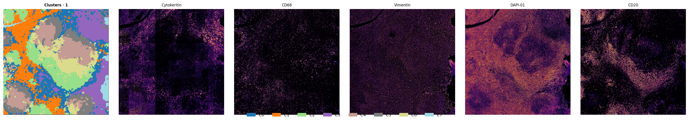
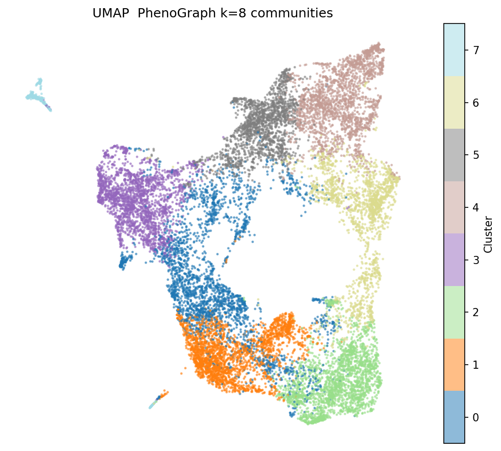
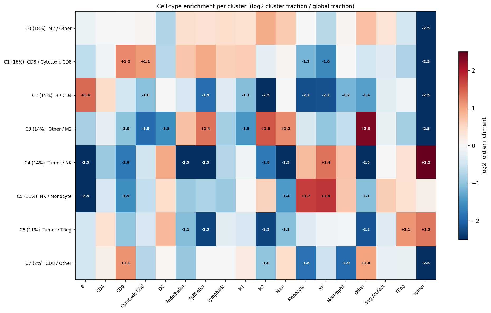
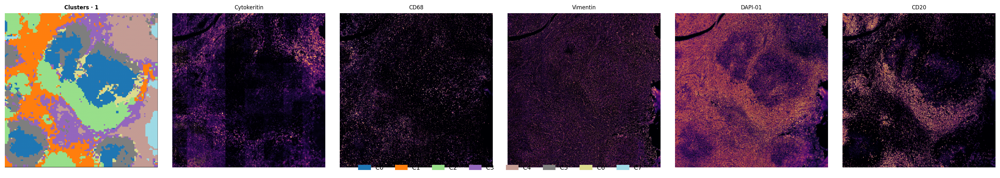
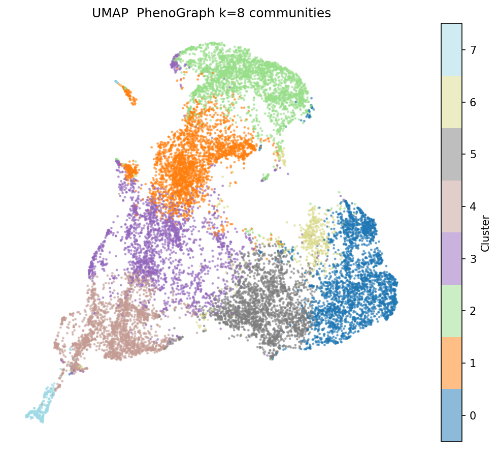
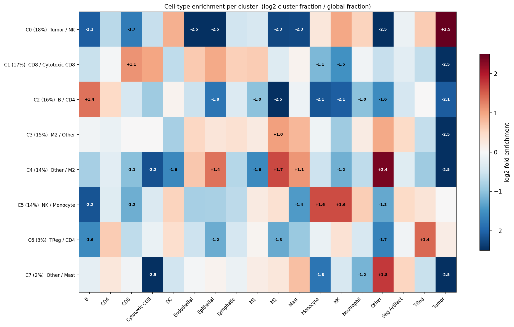
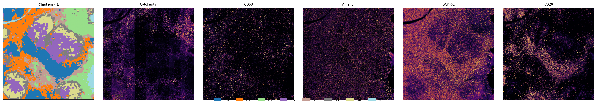
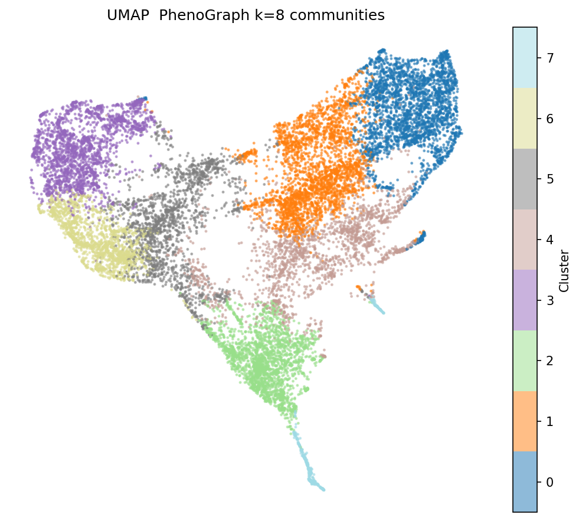
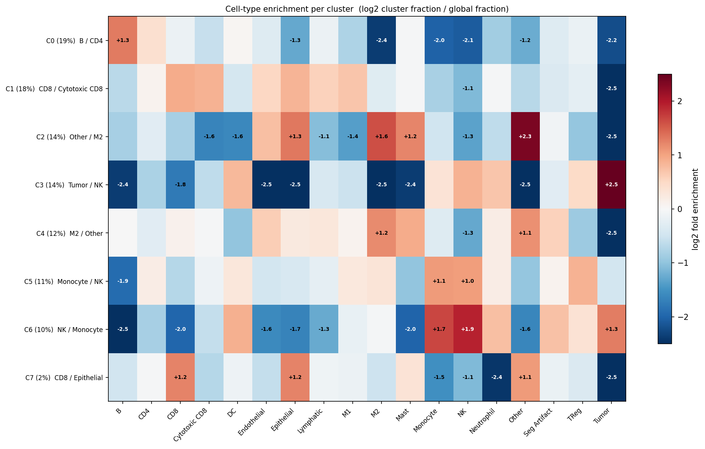

# Spatial Region Analysis — CODEX_cHL

**Dataset:** CODEX_cHL · 41 markers · 17 cell types · 1 patient slide
**Settings:** patch_size=128px · stride=64px (50% overlap) · PhenoGraph k=500 → 8 communities · PCA 64 components
**Models compared:** CIM · CIM_ProgFusion · EarlyFusion32

---

## Summary statistics

| Model | Patches | Communities | Modularity Q | Between-cluster JS ↑ | Cluster sizes |
|---|---|---|---|---|---|
| CIM | 15,500 | 8 | — | **0.354** | 2743 / 2444 / 2255 / 2185 / 2139 / 1725 / 1720 / 289 |
| CIM_ProgFusion | 15,500 | 8 | — | 0.336 | 2745 / 2699 / 2554 / 2271 / 2222 / 2189 / 505 / 315 |
| EarlyFusion32 | 15,500 | 8 | — | **0.355** | 2902 / 2845 / 2199 / 2150 / 1819 / 1738 / 1512 / 335 |

Between-cluster JS = mean Jensen-Shannon divergence between cluster cell-type compositions. Higher = more biologically distinct compartments.

---

## CIM

### Spatial map + marker overlay

### UMAP coloured by cluster

### Cell-type enrichment per cluster (log2 fold)

---

## CIM_ProgFusion

### Spatial map + marker overlay

### UMAP coloured by cluster

### Cell-type enrichment per cluster (log2 fold)

---

## EarlyFusion32

### Spatial map + marker overlay

### UMAP coloured by cluster

### Cell-type enrichment per cluster (log2 fold)

---

## Key observations

**CIM** and **EarlyFusion32** achieve near-identical between-cluster JS (0.354 vs 0.355), but CIM's cluster sizes are more balanced — only one small outlier cluster (289 patches, ~2%). EarlyFusion32 similarly has one small cluster (335 patches) but otherwise distributes tissue more evenly across 7 main compartments.

**CIM_ProgFusion** shows the lowest JS (0.336) and two notably small clusters (505 and 315 patches). Its progressive dual-branch fusion continues to produce a smoother embedding space with less sharp compartment boundaries.

All three models converge to 8 communities at PhenoGraph k=500, suggesting this granularity reflects a robust structural scale in the CODEX_cHL tissue architecture.
