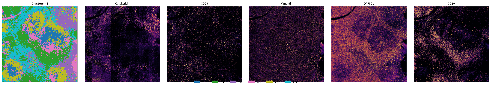
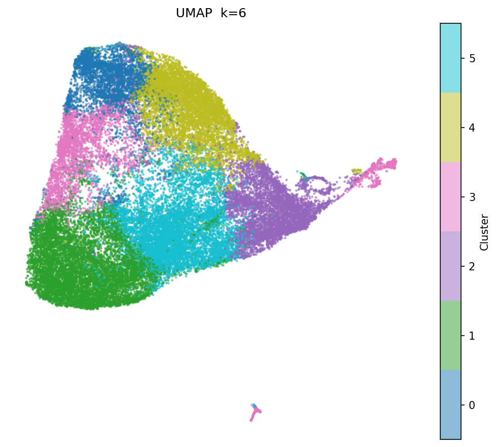
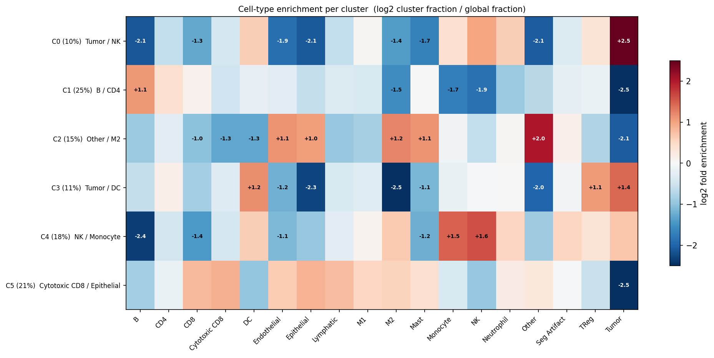
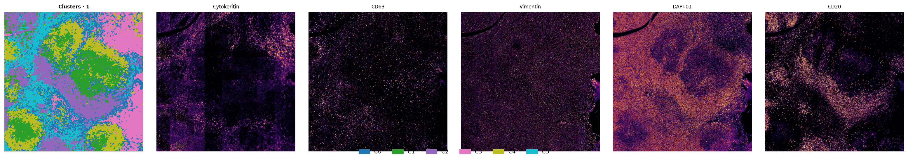
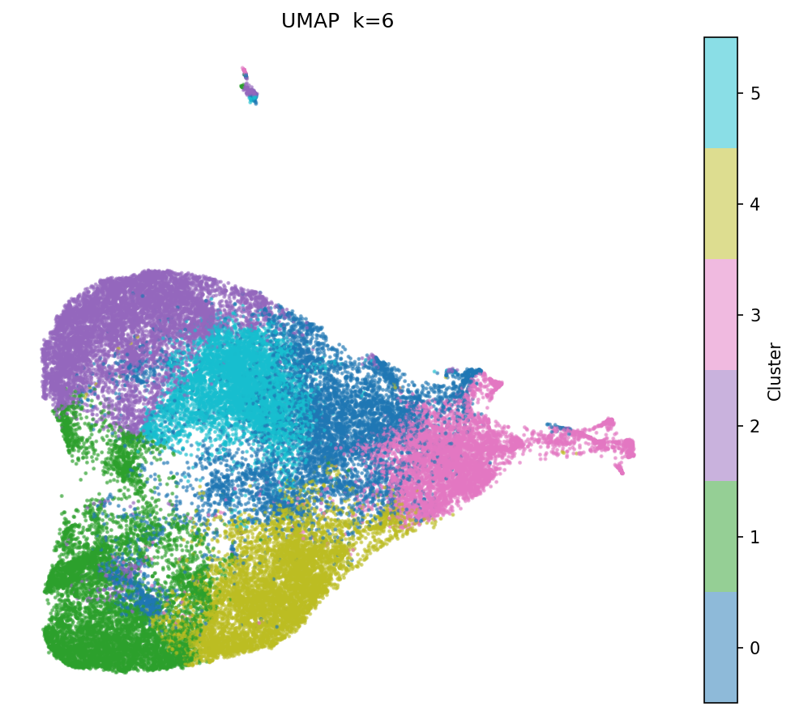
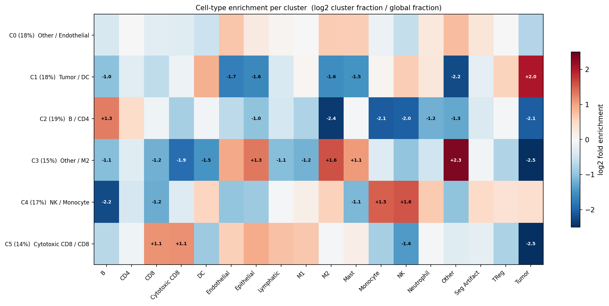
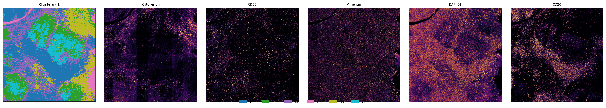
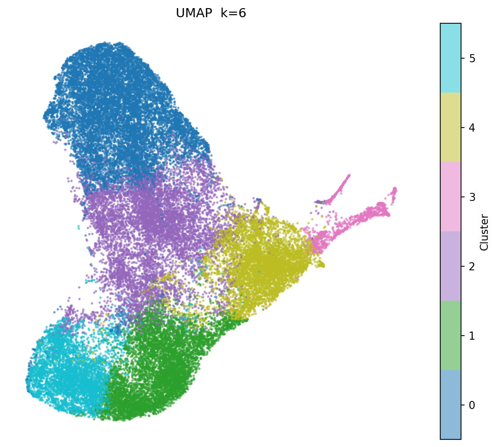
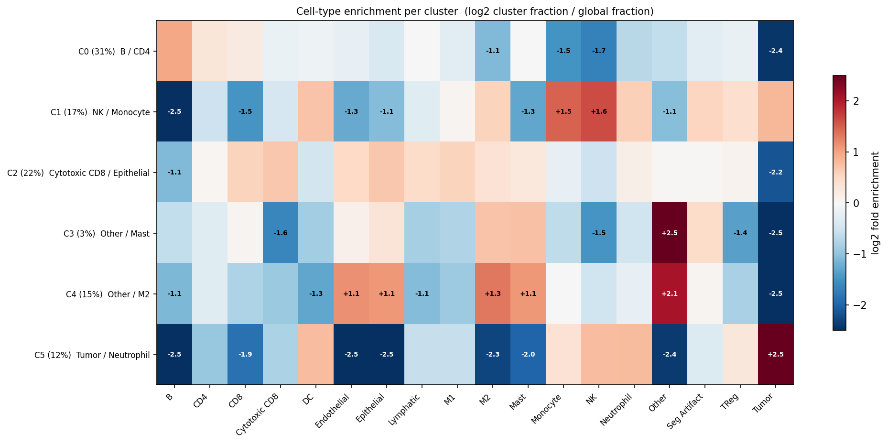

# Spatial Region Analysis — CODEX_cHL

**Dataset:** CODEX_cHL · 41 markers · 17 cell types · 1 patient slide
**Settings:** patch_size=64px · stride=32px (50% overlap) · k=6 clusters · PCA 64 components
**Models compared:** CIM · CIM_ProgFusion · EarlyFusion32

---

## Summary statistics

| Model | Patches | Between-cluster JS ↑ | Cluster sizes |
|---|---|---|---|
| CIM | 62,499 | **0.340** | 6.4k / 15.5k / 9.5k / 6.8k / 10.9k / 13.4k |
| CIM_ProgFusion | 62,499 | 0.329 | 11.1k / 11.3k / 11.7k / 9.2k / 10.4k / 8.9k |
| EarlyFusion32 | 62,499 | **0.357** | **19.2k** / 10.8k / 13.7k / **2.0k** / 9.2k / 7.6k |

Between-cluster JS = mean Jensen-Shannon divergence between cluster cell-type compositions.
Higher = clusters are more biologically distinct.
EarlyFusion32 achieves the highest JS but with a severely imbalanced partition (one cluster dominates with 30% of all patches, one contains only 3%).

---

## CIM

### Spatial map + marker overlay

### UMAP coloured by cluster

### Cell-type enrichment per cluster (log2 fold)

---

## CIM_ProgFusion

### Spatial map + marker overlay

### UMAP coloured by cluster

### Cell-type enrichment per cluster (log2 fold)

---

## EarlyFusion32

### Spatial map + marker overlay

### UMAP coloured by cluster

### Cell-type enrichment per cluster (log2 fold)

---

## Key observations

**CIM** produces a well-balanced partition into 6 spatial compartments with moderate between-cluster distinctness (JS=0.340). Clusters vary meaningfully in size, suggesting the model captures a range of tissue regions at different scales.

**CIM_ProgFusion** gives the most balanced partition (all clusters 8.9k–11.7k patches, CV≈12%) but slightly lower JS (0.329). The progressive dual-branch fusion appears to distribute spatial variation more evenly rather than isolating sharp boundaries. This is consistent with its superior NMI/ARI on cell-type clustering tasks — it builds a smoother, more continuous embedding space.

**EarlyFusion32** achieves the highest raw JS (0.357) but the partition is heavily skewed: one cluster captures ~30% of all patches while another captures only ~3%. This mirrors the MIBI_MAP finding where EarlyFusion32 collapses spatial structure into a dominant tumour vs. non-tumour axis, with residual clusters fragmenting edge cases. The high JS is driven by these extreme minority clusters being very distinctive, not by a rich multi-compartment parcellation.

**Recommendation for spatial tasks:** CIM_ProgFusion is preferred when balanced tissue compartmentalisation matters. CIM is a reliable default. EarlyFusion32 is not suitable for spatial region discovery.
